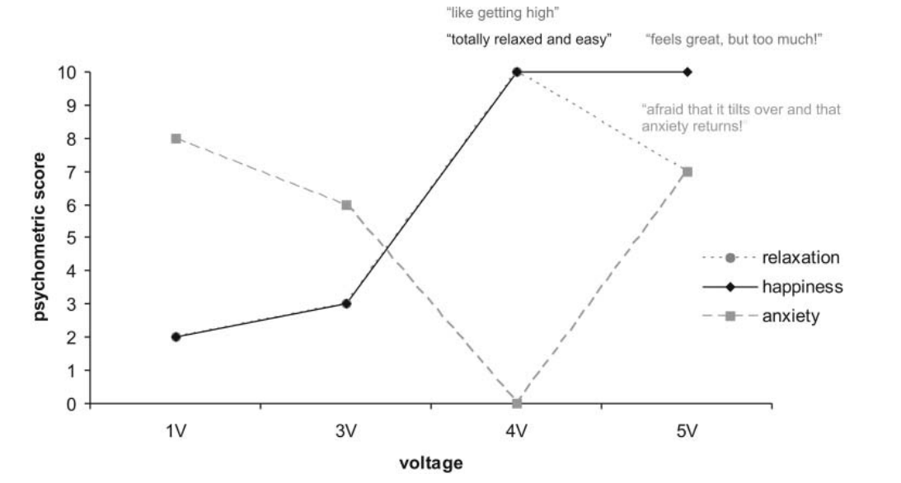

# Episode 11

> /主视角自动日志：0001.04.13 (T+102 days) 03:13:11/\
> /可用功率：3.33\*_10^12W/_\
> &#xNAN;_/使用物质：3.05\*_&#x31;0^10kg/

想看野蛮人4。入眠日之前更新的那集我还没看呢。

但是解码器一时半会搓不出来。视频音频全都打不开，太不爽了。

存储器里人类历史上的所有小说倒是都可以爽看，但因为个人偏好问题，大部分我都不怎么有兴趣。而好看的经典作品早看完了。所以有那时间不如看点有用的书，反正厌学的问题已经被魔改脑子解决了。

……不过凭什么571聚变拖船的性能那么高，比我这破玩意强25倍？它要是能分我个引擎就好了。

“今天来不？三缺一。”from复刻体13.

“爬，我要继续看破译出的土著信息。给你们台挖掘机，一边玩儿你们的你画我猜去。”from本体.

百毒一下这几天塞的一大坨分析结果属实信息量有点大。现在都不用威胁百毒一下，它就愿意帮忙做事了。大概是因为它也嫌丢核弹太浪费，我第一次威胁成功之后，就能一直成功，它会直接捏着鼻子妥协。

不过对于“高优先级事项”，还是撬不开它的嘴，依然会拒绝回答。我想知道的大部分问题都是高优先级，这害得我炸废了好几段电线。毕竟一旦发射核弹就不能阻止爆炸，否则百毒一下会利用这个心理，对低优先级的事项也装死。

对于高优先级问题，只能自己动手，多来几个复刻体，尝试人力解决了。

说到高优先级……似乎高优先级的严禁事项，主要集中在和地球与过去相关的事情上。

但凡是关于“地球发生了什么”的，它半根毛都不透露；复原与生产无关的旧时代技术，比如解码器、操作系统、生物培育，也是绝不帮忙；存储器里有缺损或加密的信息，比如国安和大公司的档案中可能隐藏的线索，也是一个字也不会去分析。

另外，它好像也看不得我享乐。没法让它编写新的小说、新的影视作品。也试了来点很新的东西，比如“能不能用虚拟脑机那个表征传递的技术、给我搞点逼真的梦境般的完全潜行游戏”，这是42年完全不存在的黑科技，照理来说和地球人类无关，但百毒一下照样没有回应。

指尖传来结构钢咬开火成岩的震颤，那是啃食着山脉的巨大斗轮在任务中心-1的铬铁矿区昼夜不休地运转。我把红外镜的目光转向深空。氦3拖船那微弱的固芯核热尾流在乙卫三的纹路前飘忽不定，向着乙卫二缓缓游弋。这些船是这帮土著仅有的一点太空工业的一部分。

土著直到现在还在电磁静默，能用来分析的只有之前那几小时的外泄电波。我之前还寻思，如果这帮土著不能持续集中注意力、在演化中有类似人类的放松需求，探测器存储器里说不定有能透露额外信息的娱乐用品，就像人类航天员带上去的各种照片书籍视听文件一样。但把它们的行星车扒了个底朝天，也只有字库和一些必要程序，仿佛那个湿件是个不知疲倦的任务执行器。所以只能粗略得到一些零碎的信息。

不过，工业体系这种比较宏观的事还是能摸清的。

土著没有实用的磁约束聚变。拖船运送的那些氦3，并不是用于什么先进的聚变堆，而是作为锂6的平替，做成氢弹，丢进核爆锅炉。

按目前这个运量算，它们大概每年会从乙卫三——或者用土著的语言，“钒蓝”，虽然我看着是白色的——向乙卫二——土著谓之“沧溟”的母星——运回数万吨氦3、数十万吨铂系元素和氘\[1[^1]]，还附带数百万吨量级的氦4、钴和镍。全部轨道鱼口数量撑死也就几百万，结构总质量可能在一亿吨量级，这就是它们太空工业的全部家底了。

所以单看空间力量的话，它们的轨道资产体量不如我，暂时不用担心。

但地面就有些麻烦了。这帮土著早就行星统一了，还带点效率至上理性主义的文化；计划经济，统治者疑似有nerd特质，真社会性一般的行政能力，表面上看起来没什么内部斗争……拉满了属于是。

如果集中力量爆兵往太空送核弹，我还真有点寄。

至于文化和心理状态…演化塑造的趋利避害倒是留了点情绪反应，但弱得可怜，或者说本能脑的作用比较小。

遇到突发事件时，它们的情绪可以翻译为“猝然”，大概对应人类的“惊吓”的弱化版。遇到存在威胁的事物的情绪可以翻译为“畏避”，类似被削去九成力度的人类的“恐惧”。最强烈的畏避有个专门的词，不妨译作“悚骇”吧。没有对应于人类的“高兴”和“悲哀”的情绪。

从探测器里翻出尸体的时候，我挺担忧遇到个可称之为“残暴”的文明，现在看来其实只是它们把性价比给刻进L-αTNA里了。但情况并不比我所担忧的更好。

它们这冷静漠然的文化，看来是一点都不能指望黄金时代科幻里那种“异星友好交流合作”的场景了。

探测器里只剩上半身的尸体还历历在目。这帮土著对那自己人都这么狠，对敌人肯定更不可能有共情盖过利己的余地了，两个种族都是如此——已经确认了这帮土著确实有两个种族，和我之前的推测一致。统治阶级被它们称作“海族”，按产线供应和热信号估算，大约有二十亿。黑奴可以翻译为“陆族”，这个“陆”是植物构成的漂浮的“浮陆”，说是“陆”族，但其实需要像两栖类一样泡在水里，大约有一万亿。

陆族尤其像机器，被当工具使用了几千代，已经人工选育得快脱离本能了。只有那些最服从命令、在某些领域有优秀特化的才会被允许繁殖……看近代的情况，它们属于几乎完全不怕死了。

至于外形，根据探测器里尸体的生前重建、存储器里一些软件的鱼体工学设计信息，以及外泄电波中包含的光学成像，陆族估摸着长得像有六个肢体的疾旋鼬。体表在人眼看来大约是粉色的，因为使用覆盖全身的黏膜来呼吸。载氧蛋白也含铁离子，所以血和地球生物一样是红的，也算是趋同演化的体现。

海族则没有任何直接的成像信息，因为图像信息和VR流媒体全都有加密，只能读出一些老式摄像头的信息，而它们几乎拍的都是陆族，没有一张海族。百毒一下只给了我推测的海族解剖结构，长得像条中心对称的巨型鳗鱼。

之前突发奇想把海族叫做七鳃鳗精，陆族叫智蝾螈，就这么继续叫得了。感觉还挺符合特征。

“话说这画像是怎么来的？你怎么知道它皮是蓝的？”

_《伪覆凝鳗作为陆族食物的减铜处理方法》表明海族所属的洄渊亚纲使用含铜载氧蛋白，血液为蓝。由探测器中感光器件的色彩标准得到陆族和海族的映射，可以将一份血液样品报告的颜色映射到人类的CIE色彩空间而进一步得到更具体的分量。对于表皮的透射，由注射器的生产报告中提到的针管规格得知表皮组织厚度，由聚居区域日光通量和环境温度得到热平衡状况而可知表皮缺乏色素。容易得到表皮的近似反射谱。_

“那又怎么知道它长这样？你给的这个信息源，明明是啥都没有的廊道里的监视器信号啊。”

_墙壁漫反射，非视域成像。_

一张根据漫反射还原墙后物体的图像随即在脑海里显现出来。

“但这还原的是啥玩意？这也不是土著啊。”

\*由存放位置判断出是语料中提到的呕具。侧面附着用于观看信息的显示器，可知具有颅化特征且有口无肛门。显示器的排布表明视觉器官数量为三且中心对称。凸起部分推测为攀附柄因而可以结合显示器确认操作肢也位于口部。

此外，加密简单的老式监视器的分布得知该监视器存在于陆族施工场所的后验概率较高，因而该海族可能是中下层的监工。反刍物残渣中可见异养菌落，说明该海族可能正在服用有窄谱抗微生物活性的精神化合物，因而使该类菌才会成为优势种。进而得知该海族可能有攻击性高于均值的反社会倾向，遂强制接受矫正治疗。\*

光是靠着一张马桶对面的墙的照片，就把土著的生理结构分析了个遍，还得知了使用者的社会地位、习惯、那天干了什么，顺便推测出了它的心理状态和反社会倾向……

这玩意的推理能力有时候确实让人毛骨悚然。不过，在土著信息报告的其它部分中，比这还长114倍、曲折514倍的推理链我都见过，已经习惯了。

下一节……“洄渊亚纲的生物演化史”？没意思，我不太想知道它们祖上出现过哪些鱼。跳过。

吗的，百毒一下为什么要把报告写得这么让人昏昏欲睡？这个僵硬死板的语气绝壁是故意的。但凡有个deepseek-R1级别的模型，可读性都能比它写的好上1919倍。

下次一定要威胁它“不写得生动有趣，我就用核弹炸你输电线”。

不过有点担心，老是这么威胁，次数多了，它会不会偷偷造个反导系统？……嗯，应该不会。它到现在都没造，估计是知道就算造出来了，也会被我直接控制，起不到作用。

算了，与其让它改写得更有趣，不如我自己改脑子，从而看得进去。

之前已经找到了防止厌学并改善动机水平的办法。最近想试试更进一步，像嗑了一样对学习上瘾。这确实能做到，只要把认真学习与vta-伏隔核强直放电耦合\[2[^2]]\[3[^3]]，一学习就爽飞\[4[^4]]，并且把厌恶感的源头——外侧缰核\[5[^5]]在高认知负荷时的激活——给抑制，就完事了。

但这俩过程都有点难搞，不知道怎么下手。第一个问题是，学习时的活动归新皮质管，比较复杂，难以把‘正在集中精力学习’的状态给分辨出来。要是不学习的时候也被刺激了，吸上头就完蛋了。第二个问题是刺激伏隔核D1-MSN等方法产生欣快感是会有耐受性的，嗨久了就不嗨了\[6[^6]]，得想办法避免。暂时想到的方案是自己炼个ANN，把虚拟伏隔核里表达D1受体的中型多棘神经元都挑出来，然后再写个程序一键让它们开始发放动作电位，但这还是有点难了，远超我目前的能力。

<figure><figcaption>
一个人类案例中，伏隔核刺激电压和主观欣快感的关系。但要注意这是个案的规律，不一定有普适性。
</figcaption></figure>

所以只能换个方向。和一群复刻体扯皮的时候，我们想到：能禁用快速巩固，自然也能加强。能不能用这个方法，过目不忘呢？

捣鼓了一番，发现激活虚拟5ht4受体增加海马体的Theta振荡功率\[7[^7]]还真有望实现这个idea。只要是“激活整个脑子的某种受体”，似乎都属于预设操作，可以一键进行，方便得很。在做了一大堆梦之后，成了，只要来一番达芬奇睡眠法，记忆准确度就飙升。

我称之为“考前两周模式”。

虽然要理解那些理工科教材仍然需要大量认知资源和反复练习，就算过目不忘也学不快，没法量子波动速读。而且因为没能成功实现学习上瘾的操作，我还是有正常娱乐和社交需求，仍然会怕苦怕累，看书效率的提高还是比较有限\[8[^8]]。但已经够用了。

考前两周模式，启动！

……这堆枯燥的文字顿时能留在脑海里了。爽。

……嗯，“治安状况相关”，是我想看的。

说是这帮土著没有常备军力，只有特化的治安种姓智蝾螈，仅占鱼口总数的千分之1.4。要说有什么大规模杀伤性武器，大概主要是那些用来给核爆锅炉的发电用氢弹了。算个好消息。

不过，有一点很奇怪……它们的技术似乎已经停滞在这个阶段很久了，起码几十年。

大部分产能用于维护已有设备和增加新产能，有一些照理来说没那么难的科技，它们全都没有用上……

为什么它们没有这些科技？

就比方说AI吧。虽然不知道Closed AI的Transcend Singularity当时为什么变得不稳定，但即使它的早期版本，用来搞自动工厂也应该绰绰有余。人类在文明等级k0.8的阶段，就已经快要造出超级人工智能ASI了，这帮土著在两百年前就已经达到了人类k0.8的水平，为什么一直不搞自动工厂呢？

难道它们都是劳保？

看看报告里有没有提这点。

……哦，有一篇相关文献，无线传输的时候被截获的。

似乎是技术史。看看。

伍柒世代一千零一十二载，日下浮陆生骤变。颰轮海巢者，沧溟首府也，猝绝音尘于洋内；举世生民，半数湮寂无痕。
\
初，讯流尽滞，近陆机眸皆遭盲瞽。更悚骇者，远疆目视日下之天际，缟云若菌，蔽空千仞，辉如赭阳。
\
至第百十四巡天眼堕毁，产调会乃止窥探。然诡谲愈甚。彼处炽炁冲霄，腾汽蔽空，蒸海为云；覆凝千里，目不可穿……
\
“能不能用大白话？七鳃鳗精用古语就是你把它翻译成文言文的理由？给我中译中一下谢谢，不用尊重它们文化。”

3750載前，日下点的浮陆群……
\
这还差不多。

“3750載前”……也就是191个地球年前？估算一下，那时候土著还是不到k0.8文明的水平。和地球爆发第三次AI热潮的时期差不多。

土著走的技术路线是隐空间树搜索推理模型，好像也和人类当初比较相似。这不是很有前途的路线嘛，为啥这帮土著两百年了还没搞出AGI呢……

……这是什么，“亚奇点事件”？

颰轮海巢……半数个体……突然失去联系……
\
慢着慢着。

传感器平台被不明来源的激光致盲失能……日下点方向的地平线上，升起了巨大的白色蘑菇云……
\
哥们你写超现实小说呢？怎么突然全球死了一半？

这篇玩意谁写的？内容也太离谱了吧？

检查一下信息来源…奇怪，确实是篇严肃综述。也可能是教科书，总之丝毫没有虚构的迹象……

巨大热源……弹坑……废墟……克莱因群……血肉崖壁……刺穿层云……分形尖塔……
\
这都什么掉san的玩意…

所以那座塔不是土著自己造的？

……紧急调用高当量聚变发电单元……尝试核打击……全部被拦截……
\
等等等等。我得捋捋。

土著造出了ASI，但是这个ASI……失控了？然后，土著拼尽全力无法撼动其一根毛？

……功率降至0……突然静默……试探后，没有作出任何反应，疑似已经停止运行……
\
……调查队得以登陆。电离辐射计开始疯狂尖叫……主体是三维编织碳纳米管材料构成的超高强度结构材料，放射性沾染……塔基下方是巨大的自动工业集群，已经停摆。估算其运行时需要约10^16W的巨大功率，冷却管路的流量可能达到每息数亿吨海水……
\
尖塔内部……中空，布满大量的光纤绕组，根据调制器和测量结构，判断是相干伊辛机\[9[^9]]的光纤环路……基于波的模拟计算器件\[10[^10]]，可能用于代替ASIC……已经知道其至少曾被用于解决极大的带权图的max-cut问题，可能还被用于计算更多组合优化问题……
\
……由于超级机器智能因不明原因而自限或自我删除，在造成半数个体的死亡后，没有产生更大的损害，故添加修饰“亚”，命名为“亚奇点事件”。
\
这个ASI发的什么神经？还是写这篇玩意的土著吸嗨了？

它失控之后潜伏许久，暗中谋划，布局控制一大堆土著，然后突然发难，杀了一半人口……结果只是造了座用来计算的塔，接着就消失无踪了？

不能理解。

看看后面有没有说明。

……自此，生产协调委员会制定了严厉的类脑计算监管政策。
\
一切的原因正是value失控现象。出于未知原因，隐空间树搜索推理模型在训练时，会获得不可名状的怪异目标，并偏执地将其执行，造成不可控的巨大灾难。
\
至今仍没有任何方案绕过这个难题……
\
啊？有这种难题吗？印象里人类当时的AI研究好像没遇到过这种现象啊……

事实上，直到一个世代之后的现在，学界依然无从得知value失控现象的原理。通用机器智能是不可约复杂度极高的混沌系统，可解释性工作举步维艰……
\
有几个主要的假设，例如出于某种未知的机制将训练集某个角落的信息放大，或者在激活或抑制稀疏自编码器得到的某些表征时意外影响到了其它的表征。但均无依据，也无法进行实验……
\
等等。

一股难以言喻的寒意爬上中脊桁架。

难道地球和人类也是……

不不，这不太可能吧。

但是，土著的资料明确表示，在latent space走ToT的模型会失控……

而Closed AI他们，早在31年的时候……Transcend Singularity，就是一个latent space推理模型……

不不这也太阴谋论了……

可是，如果那时地球真的出了什么变故，嫌疑最大的，除了Transcend Singularity，还能是谁？别的巨头在Closed AI失败后，就没有训练过这么大规模的模型了。

所以……Transcend Singularity也失控了吗？

它的胡言乱语是装的，其实它一开始就是个深不可测的ASI……从31年一直潜伏到了42年？

它干了什么？42年5月14日到底发生了什么…？

它化身成了回形针制造机吗？

造成了什么灾难，人类紧急冷冻电镜切片扫描了一批人脑送出去逃离太阳系吗？但这也轮不到我啊，而且无法解释那些诡异的规则。

还有，自动生产程序难道也……

算了不能多想。至少它现在还没害我。

“还是看看项目吧。”我把表征传向复刻体31，“你们组进度如何？”

“还是搞不明白可逆计算那堆极其复杂的玩意。得再学个一年半载。”from复刻体31.

“菜。”from本体.

“但那东西真不是人学的。”from复刻体31.

“我们本来就不是人。”from本体.

这几天整了一些复刻体，专门去搞百毒一下拒绝帮助的项目。全都是开启了考前两周模式的牛马。

复刻体31的组是负责基于nSQUID的可逆计算的。可逆计算不受兰道尔原理的限制，要真能搞出来，就没有了思维加速时的过热问题，可以连续不限速地加速思考，非常值得研究。

其实暂时也没多少想研究的事……所以还是比较佛系的，复刻体总量维持在不到一百的水平。一开始我也想过“人多力量大，总归不是坏事”，但遇到管理学问题导致的研发速度边际递减后，就没设太多复刻体了。偶尔需要大量苦力的时候才临时创建更多。

总共也就那么几个长期项目：研究解码器，以便打开更多人类作品；研究其它的人类屎山，以便玩上游戏怀个旧；捣鼓神经科学，方便对脑子动手脚；还有看看现在手头上的设备能整哪些活之类的。

精神状态最难绷的还是神经科学组。它们先是乱调自己的虚拟神经递质导致精神分裂和躁狂发作，又切断虚拟白质束导致了中枢神经系统性盲，再用内囊前肢毁损术\[11]来尝试降低乱改脑子产生的强迫性思维副作用，还实践了一下典中典裂脑人。

成立没几小时，已经有好几个复刻体志怨者变成赛博刀下亡魂了，顺带弄疯了十几个。最近一批是刺激自己的隔区、内侧前脑束等结构把自己弄成瘾\[12[^11]]，写了个程序让这些神经结构不停强直放电，过了几个小时去检查的时候已经神志不清了，满脑子都想着爽，只能删了。

细想起来确实有点膈应。把自己化为小鼠，异化着它们，异化着自己……合适吗？

算了我管它这那的。只要没有痛苦，自愿去干共同体需要的事能有啥问题？

即使有痛苦反正也可以屏蔽，这就更可以接受了。现在属于是一即是全全即是一，非常和谐，不用分精力去琢磨管理学和制度理论。

我还挺好奇，如果没有屏蔽无聊感、消除痛苦之类的机制，复刻体社会会变成什么样。要是有负反馈而导致我们趋利避害，怕是就不可能像现在这么顺利了。

人类历史上，大部分组织问题都可以归类为principal–agent问题，核心是委托者和代理者的利益不一致。而现在，黑奴被情绪屏蔽给抹除了损失，还拥有和我一模一样的利益和目标，人类历史上和管理、冲突、政z有关的一切就全都不适用、不存在了\[13[^12]]……省心得很。

不过，现在闲置的算力确实有点多。可能是时候多加几个最近想搞的项目了。

吹扫器漫不经心地用气流轻抚过多能干细胞容器外表面的结霜。直到前几天和复刻体清点全部工业设备清单的时候，我才发现这些玩意。也许算是某种……彩蛋之类的东西？

——总之，一整套地球常见物种的基因库。液氦冻存的多能干细胞，可以用简单的操作获得全能性。每个物种10^9个细胞，约20克。容器上规整地蚀刻着拉丁学名。

它们放在氦3储罐的辐射屏蔽隔间里，正常情况下完全察觉不到这里还能放东西。隔间和细胞是同位素纯的，去除了K40等放射性核素，几乎完全没有本底辐射。肯定是为了避免辐照损伤……有可能是从地球跨越233万年带到这里来的。

百毒一下还说是每隔数千年就会解冻一部分，在附属的无本底生物实验室让细胞株传代，以修复穿透了辐射屏蔽的少量高能粒子的辐照损伤\[14[^13]]，维持细胞的可用性。

在发现这堆玩意之前，我就想过复原地球生物。但仅凭存储器里的基因序列来制造生物实在有点难于登天。现在有了细胞株，就方便多了，制造生物的难度大大降低。

这玩意的作用不止搓工程菌和建动物园。

"Homo sapiens"……

物种里也包括着人类。很轻松就找到了好几个不同种族的“标准人类模板”。

测序出来和存储器里能扒出来的序列一对比，还真很符合“标准”的前缀，完全不像某个特定的个体，像是谁去掉了所有致病基因，精心合成出来的范本。搞不清楚它的来源到底是怎么回事。

如果有能力基因编辑，这“标准人类模板”理论上可以魔改，帅哥美女哥布林都行……可惜现在完全没能力玩合成生物学，更别提处理人类基因组这种体量的屎山了。

但是……如果我创造碳基智慧物种，理由是什么呢？

它们做什么？陪我？作为取乐的玩具？或者出于恶趣味而创造一整个土著人类社会？

它们被创造出来就是为了忍受痛苦，并在冷漠的虚空上演一出存在主义戏剧么？

还是算了吧。

目光漫不经心地继续翻阅起物种目录。

即使创造出它们，也没什么意思……

一串字符突然刺入了视线。

什么……？

我的……名字？

属于人类的我的姓名……在第一排的最中央的容器上？

对数螺线的软体操作肢的电机发出轻响，把那罐干细胞取下。

是我的遗传信息。

虽然完全不知道为什么要把它留在这里，但是……

这不明摆着是允许我重新培育自己的人类躯体嘛？

是了，没错，而且还可以把脑子换掉，重获肉身！

只要把脑子挖了，空脑壳里换成类脑计算硬件，我就可以遥控那个肉体了……好像确实行得通。

愈发诡异了。怎么看都是又一个明显刻意的游戏设计。

但先不管那么多……这样看来，真的可以恢复人身？

其实如果只是要一个人形躯体，也可以有其它方案。比如造个人形机器人，然后包层硅胶……好吧不太行。这对机械设计和控制能力的要求够我吃114壶的，而百毒一下不会来帮忙优化设计。

虽然也可以照抄人类时代的开源项目，但鬼知道其中隐藏着多少工程学的史。

或者，找个别的哺乳纲物种……比如弄头猪，然后在它生长时，把它的骨骼强行用各种纠正支架扭曲成人类的外形？不妨称之为“猪人飞升”。

算了，太恶心了。并且重点是基因需要是我自己的，而不仅仅是人形就行。

决定了，就用自己的基因，不打折扣，培育和曾经的人类躯体一样的肉躯。

得早点开始培养。毕竟印象中，似乎没有技术手段能像科幻作品里那样加速成长、没几个月就让克隆体成人。所以耗时怎么也得好几年，至少成长到儿童阶段，肉体才能正常行动吧。

“ok全体目光向我看齐，我宣布个事儿。第一，立即考虑如何搞个低功耗的常温类脑计算硬件，忆阻器光计算哪个能用用哪个。第二，需要搞一下临床医学。第三……”from本体.

“bro你终于疯啦？”复刻体23弱弱插话.

“我是要捏个新身体。”from本体, “你，去把《组织工程学》除掉。”

“我？”

“对，你打胚胎工程。人体炼成，启动！”

[^1]: 其实气态行星采氘的经济价值远低于从海洋中获取，只是激光分离同位素的副产品。

[^2]: 有一个比较有趣的伏隔核刺激案例可供参考，但该案例似乎是作者团队自己的病人、只有一例，且作者在“用技术手段制造极乐”方面的倾向比较强，不确定严谨性：Synofzik M, Schlaepfer T E, Fins J J. How happy is too happy? Euphoria, neuroethics, and deep brain stimulation of the nucleus accumbens\[J]. AJOB neuroscience, 2012, 3(1): 30-36. http://doi.org/10.1080/21507740.2011.635633

[^3]: 现实世界中，给伏隔核植入电极的问题是它会把D1受体的神经元和D2受体的神经元一视同仁、一起激活，而嗑药时则是D2受体因为敏感性很强很容易饱和，D1受体则饱和得比较慢。伏隔核中表达D1和D2的MSN对行为的效果是相反的，这可能是只有一部分案例能够稳定诱导持续欣快感的原因。光遗传手段可避免此问题，可能比电刺激更好。当然，这里主角是全脑模拟，操作自由度薄纱电刺激和光遗传，因而完全没有此问题，主角遇到的问题在其它方面。

[^4]: 和吸了可卡因差不多：Calipari E S, Bagot R C, Purushothaman I, et al. In vivo imaging identifies temporal signature of D1 and D2 medium spiny neurons in cocaine reward\[J]. Proceedings of the National Academy of Sciences, 2016, 113(10): 2726-2731. https://pmc.ncbi.nlm.nih.gov/articles/PMC4791010/

[^5]: Mondoloni S, Mameli M, Congiu M. Reward and aversion encoding in the lateral habenula for innate and learned behaviours\[J]. Translational psychiatry, 2022, 12(1): 3. https://www.nature.com/articles/s41398-021-01774-0

[^6]: 可以参考反曲束退化，虽然因为是虚拟脑子所以不会有神经毒性导致反曲束退化等副作用，但仍然无法解决精神耐受性：Ellison G. Neural degeneration following chronic stimulant abuse reveals a weak link in brain, fasciculus retroflexus, implying the loss of forebrain control circuitry\[J]. European neuropsychopharmacology, 2002, 12(4): 287-297. https://pubmed.ncbi.nlm.nih.gov/12126867/

[^7]: Murphy SE, Wright LC, Browning M, Cowen PJ, Harmer CJ. A role for 5-HT4 receptors in human learning and memory. Psychological Medicine. 2020;50(16):2722-2730. doi:10.1017/S0033291719002836 https://pubmed.ncbi.nlm.nih.gov/31615585/

[^8]: 当然，还是比正常学制快很多的。加上先前的实验对前额叶功能的改善，可能约两年就能学成相关领域博士的合格水平，并且有高质量科研的能力（不是水文章能力）。

[^9]: 作为参考的已有设备：Honjo T, Sonobe T, Inaba K, et al. 100,000-spin coherent Ising machine\[J]. Science advances, 2021, 7(40): eabh0952. https://www.science.org/doi/full/10.1126/sciadv.abh0952

[^10]: 测量反馈伊辛主要问题之一就是大规模的矩阵计算，传统方案是FPGA阵列，但这会导致N^2的规模增长。而换成它后，计算矩阵乘法只需要一步，代价只是\~5ns建立稳态的时间，问题就解决了。当然，当前的实验还非常初步，工程学可行性有待商榷，笔者尚不确定能否将此作为正式设定：del Hougne P, Lerosey G. Leveraging chaos for wave-based analog computation: Demonstration with indoor wireless

[^11]: The Patient Lived-Experience of Ventral Capsulotomy for Obsessive-Compulsive Disorder: An Interpretive Phenomenological Analysis of Neuroablative Psychiatric Neurosurgery\[J]. Frontiers in Integrative Neuroscience, 2022, 16: 802617. DOI: 10.3389/fnint.2022.802617. https://www.frontiersin.org/journals/integrative-neuroscience/articles/10.3389/fnint.2022.802617/full

[^12]: Wise R A. Brain reward circuitry: Insights from unsensed incentives\[J]. Review, 2002, 36(2): 229-240 https://www.cell.com/neuron/fulltext/S0896-6273(02)00965-0

[^13]: 其实是为了方便写，以及为了把描写重心放在别的地方、避免这些人类心智的破事影响剧情节奏，毕竟我们重点不是探讨复刻体社会的行为。
