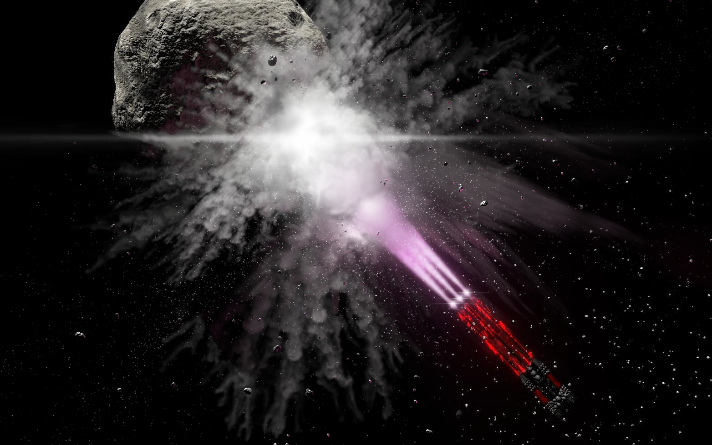
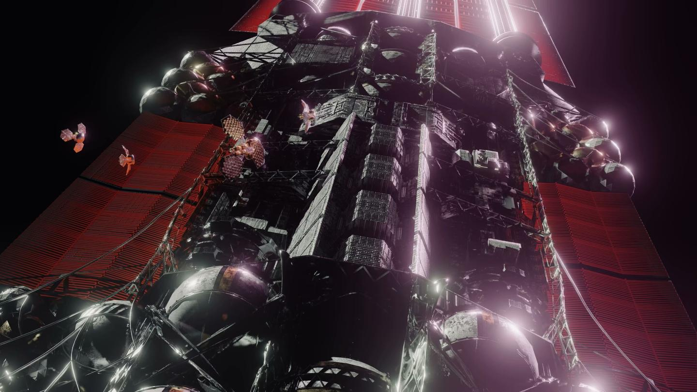
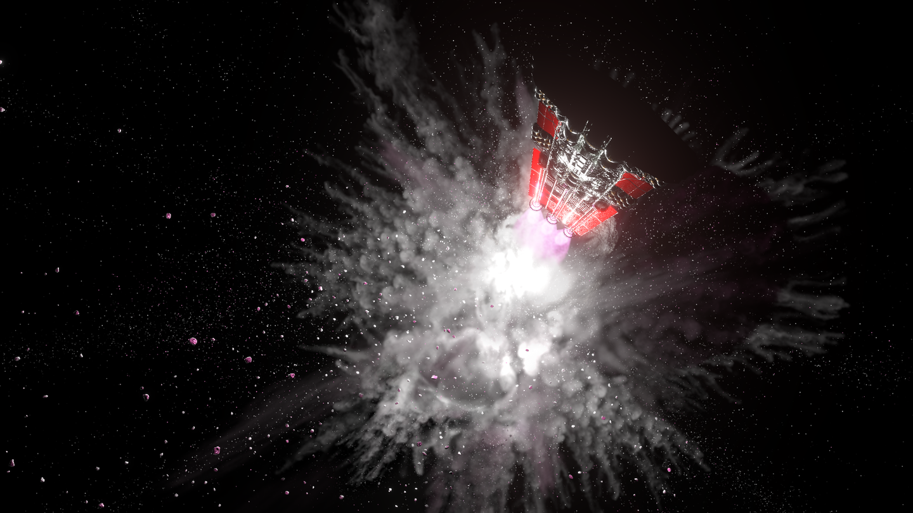
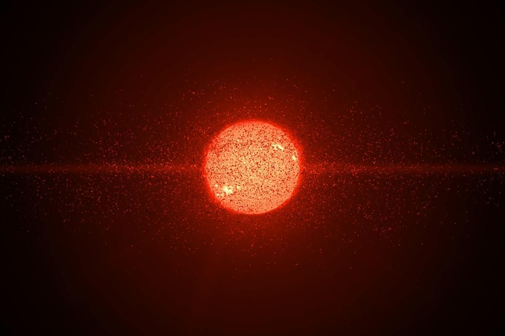

# Episode 2

<figure><figcaption></figcaption></figure>

> /主视角自动日志：0001.01.01 01:19:19.810/

两百三十万年。六万光年。

......混乱的思绪与年头在意识中猛然上涌，仿佛一盆液氮当头浇下，寒意侵彻了每一根神经。

怪异的荒诞感环绕着包围了一切，霎时间似乎视野都有些失真。

然后，翻涌而上的念头绞成了一片光怪陆离的漩涡，滚动的千万思绪最后汇聚成两个字：

“我草。”

...它在跟我说，我昨晚睡前还熟悉的世界、所有认识的人...

都是两百三十万年前的事了？

它在跟我说我所生活过的一切，到这个地方的距离连光都要走六万年？

哈，哈哈。

...我该想些什么？

在“昨晚”睡觉之前，我熟悉的整个世界都还只是蜗居在一颗黄矮星旁一隅的小石子上。

闷热的夏夜，空调的风穿过衬衫的舒爽感。像抽了骨头一样躺倒在椅子上一边看番，一边寻思着手机有点旧了要不要奢侈一把买个meta的MR...仿佛还是昨天的事。

不，对我来说那就是昨天的事。

甚至恰完晚饭之后，百无聊赖着翻过的新闻都还历历在目。

那天，多米尼加共和国大选第一轮选举刚刚落幕，新上任的总统因流行性抑郁疫情而戴着口罩进行保宪宣誓。

那天，刚果民主共和国还在战争中被疫情席卷，大量士兵出现重度抑郁的典型症状。叛军刚刚开始进攻刚果首都Kinshasa，卫生部部长Céline-Mbemba Kabila Mabiala称政府军失能士兵随地躺卧，无人照料。

那天，spaceX的超重助推器B57即将完成第100次复用，但海面版“筷子”因恶劣天气而受损，导致回收后不久B57意外坠入海中。

那天，Closed AI表示依然无法确定Transcendent Singularity的痴呆原因。Sam Ultraman称理论上它确实应该拥有不低的智能，早期测试时它远没有现在这样痴呆。Closed AI正在努力寻找问题出在哪里。

那天，北师大计算神经科学研究所刚刚表示，继冷冻电镜记录小鼠全脑突触信息后，恒河猴的全脑模拟实验也已在进行中。但发言人罗红月认为，实现第一个上传的人类依然遥遥无期，因为纠错的算力开销随着规模增长而急剧上升，难度不是线性关系。

...那天，旅行者一号还是最远的人造航天器...离地球只有\*335亿公里 \*，也就是 \*0.00354光年 \*。

而我现在......

...我除了在脑内干笑两声，还能表达什么呢...

不寒而栗地联想深空那光都走得疲惫的距离？

为“自己为啥会出现在一个远到21世纪的恒星际PPT都不敢设想的地方”而混乱和恐惧？

感叹现在这个离谱他妈给离谱开门的处境？

算了，我已经麻了。

还是先着重于摸索清楚眼下周围的东西吧。

试试把那堆眼睛多睁开几只...

顿时，无数的信息再次涌入我的大脑——如果我还有大脑这玩意的话。

引擎、燃料罐和侵蚀盾牌没什么好看的。有一些杂七杂八的复杂结构延伸出来，但似乎都是无关紧要的子系统。

比如什&#x4E48;_&#x6FC0;光帆缆绳固定结构(现已抛弃光帆)_。

激光帆？这么说，我似乎是使用激光帆启程的。

功率不可想象的超级激光，给这船加速到预定速度。到了目的地之前，再使用自己的引擎减速吗...

算了，这暂时不重要。

关键是核心部分，那一大堆复杂的机器和载荷。

那里是所谓的“主体”。

...有点眼花缭乱，但是似乎能自如地控制视野...

喔，感觉到了，我在那个所谓的“主体部分”有不少“眼睛”。

<figure><figcaption></figcaption></figure>

好多机器...

在保护壳体的内部，装满了乱七八糟的机器。

似乎全都是生产用的设备？

_冯诺依曼机器。适用于不同环境。总载荷约1919.810万吨。_

能看出那堆斗轮似乎是挖掘用的，旁边是一层层叠起来的机床。那堆筒子呢，似乎是电炉...一排排地固定在支架上。

有理由相信，这里装着一整套完整的工业体系。

足以用它们逐步建立一个完整的文明，并发展起来。

大部分机器似乎处于休眠，从未启动过，只有零星的几架无人机顺着桁架爬进爬出。

似乎是我醒来之前，已经过去了挺久的时间。它们得不停地把逐步在环境中受损的部件挪回来，回炉重造。

估计我附着的这颗冰质小行星上的大坑，以及下面被狗啃了一般的裸岩，应该也是它们挖出来当原料用的。

...难道我是在参加什么硬核版戴森球计划？被派过来用这台不成人形的伊卡洛斯来拓荒？

呃，我好像还可以控制这些机器...

一念之下，视野边缘的一台冲压机突然启动了，猛然震了一下，把冲压锤提起。

卧槽，还真能控制啊？

试试动一动...有点像动手指的感觉。

冲锤猛然往下怼去。

不错，有点好玩...似乎还有自动挡？可以让它一直进行生产工作。

算了先不管了，这堆东西也许日后有用，但暂时不重要。

先把“眼睛”再往前挪点。

错综复杂的管道，跟飞天意大利面似的，混乱至极，没有丝毫规律。

如果不是设计者有什么怪癖，那这奇形怪状的样子应该是拓扑优化跑出来的...

设计者在工程学上的造诣一定远远超过了我认知中的地球人类。

不过，材料学和更基本的物理倒是看不出什么端倪。结构件似乎用了一大&#x5806;_&#x78B3;纳米管_。在我所熟悉的地球确实牛逼，但是终究还是用普通的化学键连接的材料。还有许多结构只是普通&#x7684;_&#x589E;强碳-碳；碳纤维；高熵合金_。刚才的工厂里那堆机器也看不出什么黑科技，聚变引擎就是这里最高级的玩意了。

即便如此，这也绝对不是2042年的人类能造出来的啊...

算了反正也想不通究竟是谁造的。先继续转动“眼睛”看看吧。

嗯，最后是中心区域...热成像视角告诉我，它温度很低。

同时，还有种奇怪的感觉...仿佛我正在看自己的头。

...头？这里面装着我的脑子吗？

让摄像头凑近点看看...

_思维中枢。液态甲烷冷却液浸泡。_

确实，这里是“思维中枢”。

如果在我脑子里突然冒出来的念头都是真的、这确实是个思维中枢，那这可以进一步排除虚拟世界的可能性。

再凑近点。

我的人类躯体到底怎么了？

会不会我的本体就被泡在里面，浑身插满了管子？

还是...会不会只剩下了个脑子，成为了一个类似湿件的东西，成了缸中之脑？

那些神奇的被塞进脑子里的信息，比如百毒一下，似乎可以用高比特率的脑机接口解释。

但是这个区域好大啊..._直径57m，质量11350吨。_

如果只有个脑子，怎么会需要这么大的质量？

还是说，我的脑子和计算机阵列一起泡在液态甲烷里？

哦，有一只“眼睛”似乎可以看到它的内部。让我康康...

奇形怪状，但确实能看出是计算阵列。

但是...

人呢？脑子呢？

没有任何地方发现能装人体或者脑子的玩意。

只有两个计算阵列，一个非常巨大，一个很小。

先朝小的那个靠近一下...

有一种...怎么说呢，感觉摄像头的延时少了一点点？我现在好像能察觉非常细微的时间变化。

等等。延时变少了...？

我草。

不会吧。

“告诉我那个计算阵列的功能！”我的目光慌乱地转向那个更大的计算阵列。

_自动生产控制程序 硬件。_

“那...那这个呢？”我把目光移回小的那个计算阵列。

_...主进程：2147481145号 人类 全脑模拟中枢。_

“全脑模拟...？”

我...

我被意识上传了？！

我他吗是个运行在这堆计算阵列里的全脑模拟！

冷静，冷静...很快杏仁核的抑制就又发挥了作用。

前几个月，哦，应该说233万年前的前几个月，的新闻是怎么说的来着...

可以清晰地回忆...北师大的计算神经科学研究中心成功对一只小鼠做了同样的事情，在计算机中模拟了小鼠的大脑。

将刚刚处死的小鼠的大脑用戊二醛固定，用锇酸和免疫交联胶体金染色，在液氮温度下将大脑切成50nm的薄片，逐层用电子显微镜扫描，随后利用得到的突触连接数据，重建小鼠的大脑模型。

这种方法的模拟可以达到较高的保真度。如果再把激素对神经的影响也模拟出来，模拟体就能够重现出该人生前的记忆，人格，甚至思想。

但是...仅仅小鼠的大脑，扫描便花费了特制的高通量冷冻电镜12个月的时间。

而人类的大脑比小鼠要大一千倍。因为纠错似乎不是个线性复杂度的问题，难度更是远远超过一千倍。

他们连恒河猴都还没搞成，怎么可能快进到人类？

而且，冯诺依曼架构的计算机非常耗能，它怎么可能只花这么点尺寸就模拟出人脑？

不太可能是量子图灵机，泡着它的是甲烷，温度还不够低。就算有量子计算机在加速某些运算，也不会是主体，估计藏在哪个小犄角旮旯的超低温冷冻室里。

那，是用了约瑟夫森器件吗？...有可能。虽然主引擎的超导体似乎&#x5728;_&#x4F7F;用燃料罐里的液态氦3来冷却_，但约瑟夫森器件是弱电，说不定液态甲烷的温区就够了。

不过也有可能用了忆阻器之类的类脑计算，或者其它的什么玩意...

算了，搞不清楚。

只能确定这计算机绝对不是传统架构的。肯定超过了我的“入眠日”时，人类普及的科技。

...这些原理暂时不重要。主要是...

如果我是一个模拟...那...那我的本体呢？

我认知中没有办法能无损地扫描突触结构。如果是用和北师大一样的方法，那岂不是表明...

我的本体早就死翘翘了，大脑也被切成了无数薄片？

难道我是半夜猝死，或者掉下床摔死，然后被冷冻保存了脑子，过了多年、科技发展，于是把我扫描复活了？

还有，刚才提到的那个编号，有整整21亿号！

那是什么东西的编号？

某个上传了许多人类的大工程的总计上传编号？

还是...仅仅我一个人的复制体个数？

我会有很多份复制吗？

我是被上传来做什么的？为什么选择我？

“那...那...我本体...其它模拟...？”我的脑内有点语无伦次。

_不存在。_

...不存在？

我的其它模拟并不存在，现在在这里的就是唯一的“我”？

_肯定。_

“那编号的含义是？”

没有回应。

“到底有几个和我同源的上传人？”

_1。_

好...好吧。

虽然还是完全搞不清状况，但这个答案莫名地让我有些微安定。

比起接受“我已经莫名其妙有了一大堆复制，正在不知道的地方干不知道的事情”，我觉得还是“孤身一人变成上传人出现在不知道哪个鸟不拉屎的恒星旁边”更好受一点。

至于那个编号是什么，我猜也猜不到，也得不到回答，只能暂且把疑虑搁置在心底了。

现在，还需要的问题只剩我“该干什么、能干什么”了。

说起来，我好像有非常高的权限。至少百毒一下会听命于我，还会及时告知我想知道的信息。

我能感觉到所有部件的运行状态。和知识是两种类型的通知，不过都能即时感知到。

在运算中枢里，除了我自己，似乎还运行着一个比我占用的内存和算力还大几万倍的进程...名字叫做“自动生产控制程序”。

似乎就是那个大的计算阵列的功能。

大概，我在外面看到的那些生产设备就是它在控制吧。

这玩意的功能应该相当于人的脑干？而我自己则是大脑。

脑干的算力比大脑强几万倍，岂有此理！

喔，我好像还可以把这个自动生产控制程序关掉。

有点好奇把它禁用了会怎么样...

算了，想了想还是不作死了。

至于我的失忆，似乎也找到解释了...冷冻电镜好像只能保存突触信息，所以，我会不会是丢失了短时记忆，才会不清楚自己为什么会在这里，忘掉了发生过的事？

好吧，也不一定。也可能我什么都没忘，只是在睡梦中突然被一个邪恶老登把脑子切片上传。这样我自然也不会知道发生过什么。

...在权限方面，好像不仅能在脑子里调动这些软件方面的东西，也可以...尝试让整个身子动一动？

似乎确实能动。

除了“眼睛”和那堆生产机器，还有什么更明显的...可以动的...

对，肯定是那堆引擎...我可以启动姿态调整引擎来调整自己的姿态。

感觉有点像瘫痪了在做复健运动...用力一下...

稀薄的淡紫色等离子体于磁喷嘴纤细的钨笼中燃烧，在42个视野中烙下氢的谱线。用作APU的SMES终于放出了亘古流转着的电流，将周身的裂聚混合堆从万年的沉睡中唤醒，散热板随即睁开了暗红的瞳仁。

上百个VASIMR喷口规律地亮暗起伏着，熄灭又点燃，如深渊中滚动的彩灯，缓慢而稳定地试图推起重逾亿吨的舰体。

十余太瓦的废热流溢而出，为下方的冰晶带来吞没一切的温暖。但RCS的分布相当分散，所以并未造成剧烈的爆炸。混着包络物与盐的肮脏沉积物在剧烈的炙烤中迅速熔化，流转为晶莹的光华，碎冰组成的云雾在极低重力下均匀地扩散着。

哦哦，我能动了！不错不错，看起来非常帅...

但是咋没感觉到位移啊？

> /小行星的引力(提供-4.03毫米/秒²) 大于RCS推力(提供0.19毫米/秒²)。/
>

逆天。

这加速`度`...这堆引擎是装饰用的灯泡吗？

而且这还特么的已经用掉发电机的最大功率了！

能恒星际航行的飞船怎么这么拉跨？

“降比冲，给我开加力，质量流率拉到最高。”见它实在是弱得令人发指，我在脑内叫嚷起来。

随着我的念头，等离子体明显变稠密了，虽然喷出速度也低了许多。

好像有效果。终于能勉强感到身体有一点点移动了。

...但是怎么还是这么慢啊？

属实有点难绷，感觉和蜗牛赛跑都会被薄纱。

没有震颤，没有感觉，因为这点推力就跟几只蚂蚁在推一个人似的。

这船看着那么有逼格，没想到性能如此废物。就不能设计得强一点吗...

_否定。此设计已经接近化学材料允许的工程学极限。_

草。

...仔细算算也是，这功率和比冲，确实只能提供这点推力。

但是我是急急国王，要是真等这玩意慢慢飞开，白矮星都要凉了。

话说...我是不是有个“紧急规避引擎”？能不能用那玩意...？

> /紧急规避引擎 残余推进剂 铀235 约31.4万吨。残余工质与防止超临界屏蔽层 锂6 约19.5万吨。发展裂变物工业前，短期内无法补充。/

没法补充？...那还是算了。毕竟要是以后遇到什么“紧急”状况，没燃料去“规避”，那岂不是要寄。

好吧，那怎么办呢...让我想想...

等等，我是不是傻？干嘛要用引擎呢？

我体内不是有一大堆工业机器嘛。

只要把那堆挖掘机开出来，让它们作为手臂，对着我身子底下的冰小行星推一把，把自己推出去不就完事了？反正又不要求多高的速度。

试试像刚才控制那台冲压机一样，感受一下体内的机器...

振动传感器猛然传来了信号，一列框架上的机器被鱼贯唤醒，复位到合适状态。

不错，接下来试试让它们移动...

呃，这些玩意怎么没法乖乖沿着舱壁动...它们的底下不是履带就是锚杆，好像全都是给行星或小行星表面使用的。要是让它直接用锚杆在里面爬，钉穿了我的壳儿，可不太好。

也可能钉穿了也问题不大...？毕竟我的里边又没装着碳基生物，不用担心漏气。

算了，还是谨慎点吧。可以让那堆沿着骨架运动的维修机器人，把挖掘机抓取住，这样就可以固定住了。

很好，我要展现真正的技术了。

我发现，在控制的数量非常大的时候，似乎不需要分多少注意力去管每一台机器的细节。它们自然而然会按照我的大致意图来运动。

肯定有东西在辅助我，功能似乎和小脑类似。说不定是那个“自动生产控制程序”。

总之，没遇到什么困难，就让那堆挖掘机就位了。

接下来只需让它们的液压杆对着冰面怼下去——

强烈的推背感从传感器流入我的知觉，脑子里浮现出&#x4E86;_&#x76F8;对速度 19.2m/s_ 的字样。

歪瑞古德。这不比那个破VASIMR好使多了？

因为冰面的崎岖导致推出时受力不均，我还获得了点角动量，一边迟缓地远离小行星，一边在太空中慢慢旋转了起来。

银河在巡天镜与雷达的视野中悠然地平移而过，这回不用移动“眼睛”也能看见动态的图像了。

好，接下来还有最后一个最重要的部件可以活动...

视野转向了身后，大片的散热板之间那三条绵延数公里的直线约束装置。

主引擎。能感觉到它的存在...如同纯度极高的健壮双腿。

直觉上只要一打开，它就能像能窜稀一样提供澎湃的动力。

强而有力，强而有力口牙。

那就试试吧，启动！

我突然什么也看不见了。

带电离子束暴力地扯碎宁静的黑暗。瑰丽无比的长虹贯彻天际，把世界割成两半，仿佛文明对黑暗的审判。聚变喷流炸裂着轰鸣着碾过虚空，在亿万年来未曾有过变故的小行星上溅射起轻歌曼舞地环抱着银河的光华。

并非意外或事故导致的爆炸，而是以额定功率输出本来就会带来这样的效果。

氦4与质子毫无阻碍地轰击上去，冰晶在无比的热功率下被碾得粉碎；等离子体绽放着追逐光速，冰与岩石在每秒十二万吨TNT的输出下灰飞烟灭。

> /侦测到碎石高速袭来。预计发生撞击的＞1mm尺度碎片的数目约14570块。正在自动拦截。/

千百座短粗的激光炮塔急速转动了起来，镜头中迸发的能流照射在深空中穿梭的碎片上，使之散发着强光逐一气化。

> /约1.39%的袭来物尺寸过大，无法拦截。准备迎接冲击。/

随之而来的是强烈的震动和无数报错日志。

> /光伏膜组件少量损坏，输出下降7.2%。/\
> /100米级巡天镜镜面遭到严重破坏，失去光学功能，等待修复。/\
> /散热板114区块冷却剂泄露，散热功率下降1.4%。/\
> /2具液态氘储罐泄露。/\
> /1具液态氦3储罐泄露。/\
> /主结构轻微损伤。/

<figure><figcaption>
碎片应该更细、小行星应该更圆，但懒得细化了，如果想问“这看起来根本不大啊”那问就是战忽局拍的
</figcaption></figure>

阿米诺斯。

“停下，快停下！”

> /主引擎已关闭。/

喷流熄灭了，视野的曝光随之恢复正常。

我好像应该惊慌失措...

不过没了杏仁核的我只是个莫得感情的思考机器。

瞬间，我就冷静而连贯地明白了发生了什么——

“任何通过动量守恒推进的、实用的恒星际载具，都是超大规模杀伤性武器。”

主引擎热功率&#x662F;_&#x37;54TW_，喷流功率&#x662F;_&#x34;97TW_，或者说每&#x79D2;_&#x31;2万吨TNT_。

所以，看起来我屁股的尾气把小行星给崩烂了。

溅出一大滩等离子体和碎片。有一部分创了上来，于是坏了一堆传感器...

最倒霉的是我那只大型巡天镜，刚展开就被一块&#x4EE5;_&#x37;52mps_ 飞来的大石块砸烂了一大块镜片，剩下的部分也变形到没办法看了，估计用来当镜子照都嫌它坑坑洼洼。

那颗我附着了不知道多少万年的冰质小行星，此刻正缓缓转动着远离，碎冰与岩块四散纷飞。喷流本身并不足以让它被推动，但巨量的冰被猛然蒸发，产生了可观的额外推力。

...好像还得庆幸，这个引擎和那堆科幻作品里写的相比，其实已经算非常垃圾的了...它的比功率其实就和煤气灶差不太多，所以才只制造了这场《小型》爆炸...

要是我屁股后面的是火炬引擎，尾焰怕是能直接把一片大陆给扬了。

...几台工程子个体从我体内爬出，开始快速修补泄露的储罐。

问题不大，问题不大。不就坏了几只眼睛和光伏嘛，我还有一大堆冗余件呢。之后小心点就好了。

不论如何，我确实能飞...只要注意安全，别不小心把自己搞废了就行。

虽然我的性能和幻想中的歼星舰相比，完全就是一堆废铁——嗯我的主要结构元素是碳，应该说废碳，算了没差——但是再怎么说，应该也是可以正儿八经进行恒星际航行的。

引擎的等效喷气速度有足&#x8DB3;_&#x33;010kmps_，也就是约百分之一光速...假设那些被抛掉的罐子槽位曾经也全是燃料，
\
就有1.6%光速。

和科幻片一比慢得有点捉急，但是能飞是确实能飞......

...等等。

不对啊。

我的引擎只能到1.6%光速？

就算我是通过光帆启程的、引擎只需用来减速、
\
等于航行中的最高速度，也不应该啊...

不应该这么慢啊。

经过了230万年，但是我离太阳已经6万光年了。

这就意味着，即使我马不停蹄地一直飞、而且刚刚到达，平均速度也至少有光速的2.66%。

最高速度的数字根本对不上。

所以，我绝对不是从太阳系直接一路飞来的。

——好像只有一种可能：有什么东西，比我这船更快，它先来到了这附近的其他恒星。

然后，现在的我、或说我的躯体，才被制造，并且送到这个恒星系统。

不妨把那个更快的，并且制造了我这船的东西，称作...呃，我有点起名困难...“先驱者”吧。

先驱者是谁？

它不能带着我直接抵达目的地吗？

为什么要这样脱裤子放屁，再造我这一艘慢船？

这仨问题自然是我最想知道的，但眼下压根没法知道。

百毒一下像死猪似的，根本不回答。

不过我可以自己想办法啊。

要想测出我现在这躯体的历史有多久...感谢义务教育，我明白该咋做。

——用同位素。

嗯，义务教育教科书上都科普过C-14测年，我要是想不到这么简单的方案，那一舰创死自己得了。

不过...该用哪种同位素？看那堆维修机器，这船上说不定大部分部件都随着时间的流逝被重熔维修过了，用新加工的部件代替，并不能代表出厂状态。

“百毒一下。我身上哪些地方从来没有换过？”

_主结构件，备用低丰度元素原料仓库，聚变弹头的贫铀推送层。_

嗯？聚变弹头...？

原来我还有核弹？

帅啊！

_用于平整地形、粉碎岩体与紧急拦截。非战斗用途。_

呃...

好吧。都是开矿用的。看来我现在是拓荒船，和战舰毫不沾边。

我想想，这些地方可能有什么适合测定的同位素...

拆核弹？...好像不太行。铀238的半衰期太长，&#x6709;_&#x34;4.7亿年_，衰变的量可能微乎其微。而且很难保证当初把它炼出来的时候是纯的。

从结构件的碳上边切点下来，看看碳14？...似乎也不太行。我不知道我这船被造出来时候的平衡丰度，只能检测衰变产物氮14，而且它半衰期太短了，含量可能过于可怜，甚至早就被淹没在宇宙线导致的嬗变里了。

“百毒一下！来点书。同位素测年的。”

顿时，磅礴的信息席卷而来...但全是一大堆科普相关的网页快照，看着就感觉毫无用处。

这什么玩意？“全网最详细——科普同位素测年”？“一文带你读懂同位素测年”？

看一眼。

“同位素测年是怎么回事呢？同位素相信大家都很熟悉，但是同位素测年是怎么回事呢，下面就让小编带大家一起了解吧。

同位素测年，其实就是同位素可以测年，大家可能会很惊讶同位素怎么会测年呢？但事实就是这样，小编也感到非常惊讶。

这就是关于同位素测年的事情了，大家有什么想法呢，欢迎在评论区告诉小编一起讨论哦！”

6。

“......百毒一下，把查询范围缩小到仅相关领域的、有ISBN的正规出版教科书。”

这次终于有一些能看的书了。

我选了一本连培生的《原子能工业》，跳过正文直接翻到附录的天然放射性同位素表。

...看来看去，似乎还是得用铀系法。铀238不行，但铀235和234可以啊。

似乎并没有离子阱里的反质子催化之类高级技术，我肚子里那堆氢弹依然需要裂变初级。所以，只要把它拆了，就能刨出铀235了。

“百毒一下，我氢弹核扳机里的是铀235吗？”

_肯定。_

想想也是。钚239和铀233都半衰期太短，要是我这船预定在这儿趴窝非常久，就没法用了。

等等。我那个什么“紧急规避引擎”的燃料不就是铀235吗？直接去那儿扒不就行了嘛，还拆什么核弹，搁这脱裤子放屁呢。

很好。接下来只要从那堆工业机器里找一个干钻探的，去扒一块铀就成。开干！

......没折腾多久，我就把样品等离子体化送进了在身体里扒出来的机器中找到的质谱仪。出乎意料地顺利。

好吧，看看结果。

会是多少年呢...

呃......

*

年。\*

...九万年。我这船是九万年前才被制造出来的。

相比233万年前的“入眠日”，这已经是非常近的时间了。

那么...剩下的224万年的时光之间，究竟发生了什么事？

我只能确定三个时间点：

· 2042年5月14日，入眠日。数据库里所有信息都在这一天突然截断。而在这之前，人类文明毫无异样。距今233万年。

· 9万年前的某一天，也就是公元224万年，我的躯体在某颗离这附近的恒星被了造出来，然后被激光光帆送到这里。

· 不到两小时前，我醒了。

这之间的一切，现在还是无法得知。

还有一大堆疑点，比如那长达9位数的编号...不行，越想越乱。

算了，百思不得其解。先考虑一下由此得到的其它信息吧。

从躯体的
\
来看，就算加速段用光帆，平均航行速度也不会超过1.6%光速。

那么，我的出发地应该&#x5728;_&#x31;440光年_ 以内。

也就是说...1440光年内，肯定有，或者曾经有什么东西。那东西制造了我这船。

“我的出发地是？”虽然估计不会得到答复，但还是姑且询问一下百毒罢。

_载入突触权重矩阵前未启用日志，无数据。_

不出所料，答不上来。它真是废物！

“那么...展开巡天镜。”

我突然有个想法。

我手头上就这么些拉胯的破烂技术，一点激动人心的黑科技都没有。而且百毒一下还声称“性能没法提升，这就是极限”——那么，假设那个制造我的东西，也在使用差不多的技术，它就必不可能会虚空造船。

它肯定要依附于某个恒星系统，开采那里的物质，使用那里的能源。

所以...只要看看1440光年内有没有可疑恒星，不就行了嘛。

——还没坏的几个巡天镜将层叠的镜面徐徐展开，如舒张的蝶翼，反射着星河间点点的冷光。

“百毒一下，有没有附近恒星的距离信息？”

_每次公转周期均会以三角法确定距离。_

那就是有咯。很不错！这玩意总算是有点用了。

——巡天镜开始转向，视野稳定而冷峻地横移着。

除了“太阳”以外，最醒目的是一颗昏红的亮星，高悬于银河的一侧。

_双星系统。伴星为M4V红矮星。_

嗯...懂了，我所在的是个双星系统。天上那个泛蓝的“太阳”是主星，一颗1.76太阳质量的F型星；而那颗亮瞎狗眼的红色星星就是0.32太阳质量的伴星了。

亮度次之的，是天空中排成一列的银色光点，它们显然是这儿系统的行星。...暂时先不管行星吧，之后再来仔细看它们的特征好了。

“把1440光年内的星表列出来。”

我现在只想看看星空之间有没有什么怪东西——明显像是制造了我这船的东西。

不是吧还真有？

刚刚开始转动眼睛没多久，就有个极度刺目的红外信号...

非常近。三角法得到的距离只有22光年。

但是它的可见光怎么有点暗...？

别急，仔细看看怎么回事...

绝对错不了，没跑了。

红外亮瞎眼、和别的星星的可见光度似的，但可见光却暗得一匹......

也就是说那里绝对有一颗恒星。只是它的光被什么东西给挡住了一部分，并且转换成了低温废热。

按我手头上的同款技术，只有一种东西会达成这样的效果——

戴森云。

不是吧哥。

什么科幻玩意？

离我22光年远的地方，有...有堆人造物体包住了一颗恒星？

<figure><figcaption></figcaption></figure>
