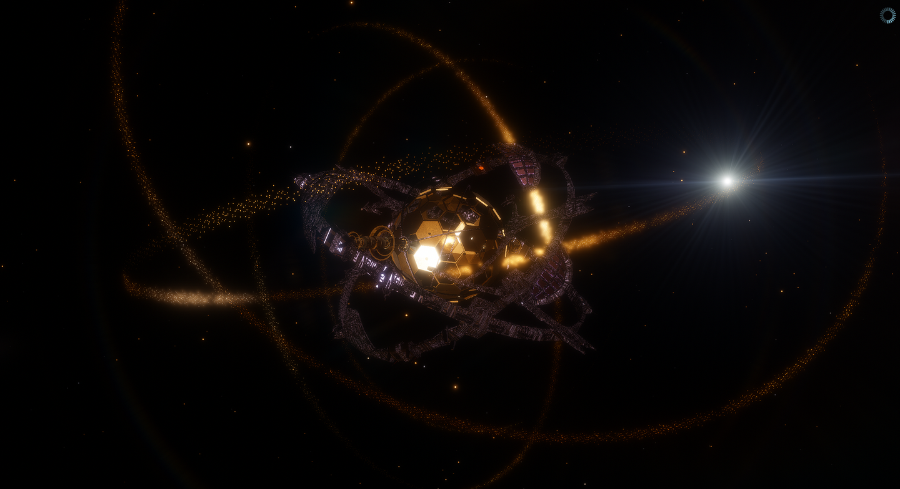

# Episode 4

<figure><figcaption></figcaption></figure>

> /主视角自动日志：0001.01.01 07:41:05/

是外星土著，有外星文明，歪星...

不是不是哥们，tmd假一赔十的外星人真tmd在我眼皮子底下啊？？？

不存在的胸腔仿佛要开始急促地起伏，各种想法如同114万匹草泥马奔过脑海......

在上涌的念头的混乱风暴攻心之下，我只能急忙脑内呼喊：

“吗...吗的...

把杏仁核关了！”

> /已抑制杏仁核功能。/

突然间，感觉脱臼的幻肢下巴瞬间归位了，抽搐的幻肢膈肌也瞬间不再呼吸急促了。

不错，瞬间冷静。

这不是我反复横跳。在需要理性分析的时候，稍微抑制一下碍事的情感，应该挺合理的罢。

咝——念三遍：我现在是无情的思考机器。

好了。可以开始分析这个破事的具体状况了。

先仔细观察。不管我要做什么决策，总得先收集点情报吧。

主镜冷峻地保持指向乙卫二，行星表面的细节无比清晰。

...它比地球大。

奇怪，虽然大气比地球还厚，却没有多少云。

表面的颜色是棕黑相间...棕色部分有点在反射日光的样子？似乎是海洋。

那么，黑色就该是陆地了...不对，不对。为什么没有任何山脉和起伏？

而且似乎有非常弱不可察的...旋转。

黑色部分的形状不固定？陆地还会动？！

冷静。我是无情的思考机器。

那有可能只是覆盖海面的藻类或者植物，这不奇怪。地球不也被森林覆盖了大片面积嘛。

“我要看到黑色部分的吸收谱。”我念想着。

随着我的想法，地物光谱分析的视角自然地在视野中跳了出来...并给出了那些黑色东西的成分：

硅，氧化铝，一堆卤素钙钛矿。

这不是光伏板子吗？

我草！

这帮土著已经给半颗行星都铺满了太阳能板——

好吧那又怎样呢？

不能惊讶，我只是无情的思考机器。

先冷静分析。

这堆玩意会非常慢地相对运动，说明它们不是固定的......是漂浮的。

是颗海洋行星。它的大半面积被漂浮光电平台给覆盖了。

...没有云会不会也是这个原因？这些漂浮平台不透水，遏制了蒸发，所以就没云了。嗯，合理。

等一下...说到底，它们真是土著文明吗？

会不会是和那个22光年外的戴森云是同样的来源，并且和地球、和现在的我有关？

不太可能...没理由出现这么多氧气啊。而且，那些明显是城市灯光的东西，不太可能是什么工业设备发出的。

以及，把天线对准那个方向，就骤然传来了嘈杂的无线电。

内容如同古神呓语，完全没法理解...所以应该和人类毫无关系。但是，如果解释成工业设备或人工智能之间的通讯，又太凌乱了点。更像是民用的。

如此看来，它们似乎有九成的可能，确实是土著文明。和那个戴森云、我、以及地球，都没有关系。

再看看行星的背面...有一大圈白色。大概是巨大的冰盖？

也正常，红矮星的行星基本都会潮汐锁定来着，永远只有一面对着太阳。所以背面可能很冷，冻了半个行星的冰...挺壮观的。

不过冰有点稀稀拉拉，中间穿插着红色的城市灯光。会不是这帮土著工业活动的废热，把冰给融化了？

不管了。总之，城市似乎也是漂在海面上的，没有任何陆地的迹象。所以，这可能是血统纯正的海洋文明。

呃，我可能会面对一群鱼人。不知道它们是怎么点出需要火的科技树的。

毫无疑问，这帮鱼人比人类先进。至少比我入眠日的时候2042年的人类先进。

但是，又好像不如我现在这艘船先进。

因为没看到它们有啥大型的太空玩意，也没看到旁边的乙卫一和乙卫三有被殖民的迹象。就算实际上有鱼人登上去了，规模肯定也很小。

那，它们有没有可能一直得知我的存在呢...？

按它们的航天表现，似乎不太可能仔细探查过这里相距遥遥30个天文单位的伴星。送些小探测器可能就是极限了。

如果我从九万年前开始，就一直躲在这颗小行星后面休眠，那它们应该发现不了我。

除非它们技术停滞或退化、曾经发现了我又缩了回去，或者它们和发送我的东西有过什么勾结和交流。但是稍微想想，这两种可能性也不大，毕竟它们以前为嘛从来不来找我呢？

嗯...所以粗略判断，它们有比较大的可能，一直都不知道我。

对它们来说，我也许是个孤零零出现在它们母星系附近的外星飞船。

哇，外星人竟是我自己啊！

我还是高等文明啊？

那...要朝它们打招呼吗？发送激光和长波好像都很简单，就像动动嘴皮子说话一样。

不对，雷达对应的仍然是视觉，那么说话的对应物应该是...镭射眼！

好几把炫酷。不对这不是重点。

就算它们真的是个不能远航的初级文明，也根本不代表我可以乐观...

首先，情况还不能确定。得先静观其变。万一它们其实知道我呢？是堕落帝国粑粑呢？

而且我现在肯定已经暴露了。

鉴于之前狠狠地用引擎喷流轰入了小行星，现在还一直开着引擎疯狂地放出高能辐射...它们只要没瞎，就算以前不知道我的存在，现在也该知道了。

我和它们这个距离，光线要走大&#x6982;_&#x32;50分钟_。所以，三个多小时之前，它们就已经看到天空中突然爆了个亮点。光一来一回要500分钟，所以，要得知它们作何反应，我可能还要至少等几十分钟。

等等，那我是不是该关掉引擎藏好自己...？

算了，没必要。早就暴露了，关了引擎也不过是沿着惯性滑行而已，被预测轨道轻轻松松...所以还是镇定点，继续开着吧。

总之，即使它们真的是对我一无所知的比较低等的土著，我也要非常谨慎...

因为，这可是半颗行星的太阳能板子，准行星级文明啊...

这就表示这帮土著的卡尔达舍夫文明等级接近1.1。再低等也低不到哪去。

发电量是2042年的人类的几千倍，社会和科技肯定也更先进...它们一定有数不清的聪明个体，如果它们不是蜂巢意志之类的玩意的话。

而我呢？只有一个傻不拉几的人类脑子，和一个爱答不理埋头开矿的工具AI。

要是被它们知道“哈哈哈这船上的外星人居然这么蠢”，我岂不是丢天下之大脸嘛？

更进一步说，它们有可能想办法把我灭了，或者拆了然后逆向。我这船除了那个自动生产控制程序和聚变引擎，没有一点黑科技，怎么想都打不过这帮发电功率是我引擎的百倍的土著啊。

必须悠着点。

“先把杏仁核开了吧。我觉得能缓过来了。”

> /已取消抑制杏仁核功能。/

顿时，满溢的焦虑、无助和烦躁重新涌入脑海。

我怎么办？

暴露会被土著揍吗？

我就一个人，怎么和整个文明谈判或者对抗啊？

如何外交...不对就我一个人这算个毛线的外交啊？

先等等，费米悖论是不是被解了？它们是天然演化的吧？我为啥刚好撞到它们处于这个技术时代？我撞见了外星土著这件事本身岂不是表明宇宙中生命很常见？那其它文明呢？我被搞到这里会不会也是高等歪星仁干的？但是历史上一直没有观察到啊，难不成真有什么大过滤器？

咝——冷静，开了杏仁核也先要保持做无情的思考机器。

但这帮土著真的迅速打破了之前我以为的一片荒凉的感觉。而且让我大为惊恐。

我现在有严重的危机感。

“百毒一下，能不能给我出出主意。”

没反应。

特么的，关键时刻就漠不关心。

“别装死！你明明是强人工智能对吧？快告诉我该干啥！”

没反应。

它好像，很可能根本就不是为了帮我而设计的。

唉，好气啊。

还得靠自己这个蠢脑子。

我想想。如果它们真是初接触外星事物，那它们应当会设法和我交流。到时候再见招拆招。

不知道它们对外星文明是什么态度。它们有见过别的外星人吗？

那个22光年外的戴森云绝对被它们看见了。不过，它们不一定能确定那是外星造物......毕竟硬要解释成尘埃云也是可以的，虽然不像一般的尘埃。

而其它方向，也没发现什么明显的东西。宇宙一如二百三十万年前那样，荒凉，寂静。

这帮土著似乎有一定的可能，从未接触外星智慧，也像以前的地球一样在疑惑费米悖论...如果是这样的话，它们也许也会比较谨慎。

但谁知道呢，一堆嗜杀蜂群似乎也不是没可能。

又或者，我难道要发一个人类语言的罗塞塔词典？然后再来一条“我方因事故误入你方双星系统，现已无恒星际航行能力，需要借用你方双星系统的无人恒星进行建设，可以分享一部分技术作为补偿”的信息？

不不，太蠢了。怎么想怎么掉逼格。感觉和“我是黑虎阿福”“我的名字是博良启影”“我是一颗蓝色行星上的碳基猴子便乘的玩意，快叫我爷爷不然核弹伺候”抽象程度相近。而且，得花大力气翻找前人的罗塞塔词典的工作，愚钝的我实在不能保证自己能短时间内理解。

唉，有点和空气斗智斗勇的既视感。

得搞到更多情报才行。

嗯...话是这么说，但是我和土著隔了三十个天文单位...这还咋刺探情报啊？

“百毒一下，我脑子里时不时就蹦出来日志和时间，那土著方向的那堆电波有没有被日志记下来？窃听一波试试。”

_日志记录所有接收到的信息。除非主动删除。_

不错，还挺懂事。

似乎可以自由访问这些数据...虽然好像只记录了我醒来之后监听到的这几个小时的电波，但是已经非常海量了。

可是它们只能被转化成鬼画符似的波形，我屁也看不懂...

肯定不能指望土著会主动发给我什么东西。退一万步说，就算土著莫名其妙地非常友好，向我发了它们语言的罗塞塔词典和常识，我一个破人类脑子也完全没法解读啊...

百毒一下也不肯帮忙。

没辙，得想想别的办法。

把眼睛绑在拆下来的小引擎上，送个临时探测器过去？...不行，飞到那边黄花菜都凉了。而且万一探测器被它们给截获了，我不就成了小丑吗。

想个法子黑了土著，劫持他们的通讯卫星之类的？...想啥呢，再来一亿个我都没这个能力。

还是只能先用望远镜，猥琐偷窥。

但是分辨率还不够高。我主镜的直径不到1km，而它们的大气只能透过最短300nm的光...角分辨率极限大概&#x662F;_&#x34;e-10rad_\[1][^1]。眼睛都要瞪爆了，也只能看到两公里大小的细节。

不行，看不清。各种建筑都糊成一片，啥都看不出来。

努力眯眼...我瞪！

我去，怎么回事？

我的主镜怎么甩出了几根面条啊...这啥玩意啊？

_异形镜面。增加有效孔径。_

异形镜面？呃...难不成是让这堆条条旋转起来，等效成一个巨大的抛物面？

草，瞪眼睛还真有作用啊...

> /抖动严重，时间对齐精度不足。/

什么意思？

精度不足...意思是抖得太严重，看不了？

想想也是，估计这几根金属条可能要转几个整圈、曝光好一会儿才能正常成像吧...不然晃来晃去自然会糊成一片。

抖动的原因好像很明显：我开着主引擎。屁股底下每秒十几颗小男孩的能量，肯定把主镜震麻了。

那先关掉引擎...等等，不行。

现在重要的是，做好我的印象管理。绝对不能对土著暴露“这外星船居然主要是个原始碳基猴子水平的智能体在操控”这件事。

如果土著此时正在拿望远镜瞅着我，发现我居然启航了才后知后觉地为了观测而又关掉引擎，那它们会怎么想？这不就暴露了“这外星船里是行动毫不严密、考虑不周的傻逼”吗？

虽然也有可能已经暴露了...不过姑且假设没有暴露，得避免一步错步步错。

还是用绕远路的办法吧。

先把主镜拆下来。我的加速度很低，因为体重过于超标了。所以，把主镜抛出去，一时半会儿也甩不远。观测完了再让子航天器把它推回来追上就是了。

我真机智。

好吧，这纯纯是之前犯傻、毫无远见没进行任何谨慎规划导致的。

现在就先等主镜给土著拍一张高清大图吧。

> /主视角自动日志：0001.01.01 08:13:05/

......太超现实了。

我居然真的在俯瞰一个外星文明的世界？并且细节精确到50米？

好了先别玩触景生情那一套了...我得先弄清楚这个外星文明会不会想把我弄死。

这太阳能板子的规模真是壮观。

从向阳面伸展开来，一望无际，黑压压地蔓延到晨昏线附近。没被覆盖的海域面积只有不到一半。

浅海可以更好地看清海水颜色，比深海的棕色更淡些...怎么形容呢...尿黄色？

说不定是混了氯合铁离子之类东西。

但它真的像尿。

...行了，放大看看细节吧。晨昏线附近似乎要复杂不少，说不定是住人的地方，瞄一眼先。

确实全是城市...漂浮的城市。建筑的高度似乎并不离谱。可以理解，海洋行星说不定风很大嘛。

城市像蜂窝般呈六边形铺开，点缀在晨昏线附近。把分辨率拉到极限，依稀可以看见乱得跟毛线似的道路，毫不整齐地胡乱纠缠在一起，像是被拓扑优化过...或者也有可能只是单纯的乱而已。

嗯...路上有墨水似的颜色在流动。

是连成片的载具吗？

它们还需要道路和很多载具...这就说明有出行需求，不能天天居家办公...

50米以下的细节就看不清了...只能从别的方面找找线索了。

城市附近的海水颜色比浅海更淡——更像尿了——依稀能看见些许纹路。看来城市还有水下部分。正常，海洋行星的鱼人嘛，要是能完全脱离水才奇怪。

然后是城市附近空出的大片海域，颜色比一般的海域要更暗...含有大量的碳，非常均匀。

难道是农场？海面铺满了藻类一样的微生物？

这帮吃藻药丸的鱼人的摄食效率还挺高嘛。要是当初我们裸猿能只吃小球藻就活着，怕是能多养几十倍的人。

光伏的空隙之间有狭长的航道，那堆漂来漂去的白点大约就是各种船只了。

这堆船的长度目测普遍有1km以上，恐怖如斯...但是我现在是身高25km的恒星际飞船，所以评价为小舢板。

光伏区域的中间也稀疏地星星点点洒落着许多城市，分布有些稀疏。但是规模都比较小，建筑也似乎有些简陋的样子。

所以...为啥要把城市造到这种地方来呢？

这不吃力不讨好吗？

难道它们自动化程度不怎么高，还得靠人力维护光伏板子？

得估算一下它们的人口。

集中注意力！好，注意到农场的面积总和约&#x4E3A;_&#x884C;星表面的9%_。

要知道人口，我还得知道这帮鱼人的农场效率，还有它们吃藻药丸的能量传递...唉无所谓，可以发挥天文学的优良精神嘛，数量级对了就对了。估摸着这个功率可以养活大概...一万亿个智人的代谢水平吧。

如果它们的体型和人类差不多，那就有一万亿人口。

为什么养这么多人？

古地球可是在人口不到它们1%的时候就放缓生育了啊。

而且城市都在工业区附近，没看出大面积的无人化迹象...多搞搞自动化不香吗？

想不明白。

不过感觉稍微松了口气。

哼，不过尔尔。看来它们是堕落爸爸的可能性微乎其微嘛。似乎确实只是个比2042年的地球先进、但是不能上天的土著。而且也看不到什么突然技术爆炸飞起来给我一炮的迹象。

话是这么说，但是它们的体量摆在那...真要是起了什么冲突，他们硬堆核弹数量估计都必秒我口牙...还是得审慎思考。

看看背阳面的阴影吧。

城市依然不少，不过比晨昏线附近要稀疏。红外波段有一大堆闪瞎狗眼的亮区，估摸着全是工业设施。

重工业都放在背阳面吗...可能是便于冷却吧。规划倒是挺合理的。

奇怪，城市的灯光有两种截然不同的颜色。红和黄。后者的数量比前者少得多，但是城市规模明显更大，建筑尺寸也大很多。

灯光波长偏长的...叫它红灯区得了。

...似乎不太健康，那就叫赤灯区吧。

灯光波长短点的城市就叫黄灯区好了。

赤灯区露出水面高些，而黄灯区基本完全泡在水里。不过颜色差异似乎并不是海水造成的，而是灯光本来就这个颜色。

为啥要用两种不同的照明...？

放大一下。喔，一些空旷场合有大坨的红外信号。

温度300K左右。

...这不会是体温吧？

如果这帮土著也是恒温动物，我是不是拍到了他们在集会或者密集施工啥的？

得再放大...不行，红外的分辨率太低了。

...可能可以用300nm激光雷达照一下它们。好吧开玩笑的，有点太胆大了。万一这帮鱼人觉得被激光怼脸很冒犯呢？

“孔径还能再大点吗？”

主镜上的维护机械飘了出来，把几根面条拆下，慢悠悠地爬到两根没被拆的面条顶端，然后接了上去。

不错，超级加倍。

...体温也有两种。泡在水里的和漂浮部分的人口有明显的温差。

难道它们的文明有两个物种？

也可能是分化，就像蚁后和工蚁那样。或者变态发育什么的。

住在黄灯区的可能体型比较大，智力比较高，所以数量少，而且只住大城市不住在工业区。赤灯区的估计是卑微打工鱼，主要干苦力。

难道是蜂巢意志？

...不太可能，现实中哪有魔法能让有机体之间进行高带宽无线通信...看它们分工也不是特别整齐划一的样子，估计个体还是像人类一样比较独立吧。

瞪了好一会儿，实在看不出更多东西了。

得整理一下。

1.这帮土著是水溶剂的碳基生命，和地球类似。

2.它们至少有两种生理结构差别很大的个体，大小不超过50米，而且都像地球生物一样依赖基于高频光子的视觉。

3.工业的自动化程度不咋高，社会发展似乎比较平稳，似乎没有什么特别危险的威胁。

啧，这也没多少有用的信息啊...

乙卫二上土著嘈杂的电波仍然在漏进我的耳朵，让人心烦意乱。

它们日常到底都在交流些啥？真吵。

......

怎么...戛然而止了？

土著所有波段的信号都突然陷入一片沉默，如同被什么东西掐住了喉咙。

> /主视角自动日志：0001.01.01 08:34:05/

八个半小时。光线来回一趟多一点的时间。

不存在的心脏痉挛了一下。

...它们看到我了。

准确来说，我看到它们看到我时的反应了。

不是...咋就沉默了？为啥啊？再来两句噪音啊？

不过这么短的时间就把全球的无线电资产给管制了，执行力倒是很强...

滋滋。

呃...又响起噪音了？

但是这次是纯粹的噪音，在快速扫过所有波段。

我下意识地想咽一口口水，然后发现自己没嗓子。

...不是，这帮土著想干嘛？

它们难道要搞我？这就动手了？

想干扰通讯吗？

我草怎么办怎么办...上来就有敌意吗？！

但是，这也对我没啥影响啊...这噪音又算不上强...

等等。

——我好像懂了。

它们在屏蔽自己人吗？

这帮外星人内部可能有分歧。

为了防止小规模的不受控无线电资产擅自向我发送信息，在全频段干扰它们自己的无线电吗？

嗯...说得通了。我的脑子还是有点用的嘛。

看来这帮土著确实不是蜂巢意志，至少没那么万众一心。

可以理解。如果是地球遇到了外星飞船，政府也会第一时间采取措施防止反人类者抢险进行什么后果不可预料的通信。

...希望别是我理解错了，不然就成小丑了。

所以别的反应呢...？怎么除了开始干扰就没其他动静了？

它们到底打算干什么啊？？

这回真是在线等了。我是急急国王。

...不过没动静好像也是理所当然的。

如果能类推地球社会的情况的话，或许，它们的决策者可能正在开会之类的，商议要怎么应对我...？

还是不妄加揣测异星的情况了...万一它们可以把脑子用神经接一起啥的，根本不需要开会交流呢。

在它们做出进一步反应之前，我得赶紧思考一下自己该怎么办...

表示友好？豁出去了，实话实说，请求帮忙？威胁它们和我保持距离，等我发展起来再进一步接触？

冷静...给我再次变成无情的思考机器。

——先想想，如果我是土著，我会怎么做？

虽然这样直接换位思考有点傲慢...我一个无毛猴子怎么可能去揣测对方一整个文明的意图...但是最基本的东西还是可以试着确定一下。

如果我是土著的决策者，我看到一艘外星飞船突然出现在家门口30个天文单位的地方，有着能恒星际航行的聚变引擎...我怎么想？

首先是力量对比。外星船看起来势单力薄；但是技术更高。而且，它好像打算进行发展。如果发展速度和技术是正相关的，那么外星船的力量很快就会赶超。所以，我不会认为自己很有优势...也就会更谨慎和猜忌。

然后，得试探吧。信息和情报是一切的基础。

比如让发送的信息包含表波和里波的不同内容，看看对方能否解析...不对，这纯纯的毫无卵用。外星智能的认知能力不知道比自己高到哪里去了，任何对能力的试探都没必要，属于班门弄斧。

至于对其他信息的试探...也可能并没有多少实际作用。谁知道外星船实际上在想什么呢。

外星船回复的任何信息都可能别有居心...如果做最坏的打算，就要认为外星文明的目的总是发展优先。都星际时代了，还有什么理由留着土著呢？又不能社会学+3。任何留着土著的行为...似乎都对发展生产力没有收益。除非是有什么特殊的癖好，比如出于审美、保留了像原始的碳基生物集体一样可能出现的慈悲心理和只适用于古代种群内的道德观 这种对开矿造戴森云并没有帮助的动机，想留个吉祥物。

...没有留着土著的动机，也没有非土著活着不可才能提供的东西。

那我...

冷汗仿佛蔓上了脊背。

那土著就应该假设...外星船发出的任何友好信息，都是诱骗。

这不就猜疑链吗？？

吗的。小时候还对这些简单博弈嗤之以鼻来着。真遇上了才知道确实是非常严肃的问题。

那怎么办...这帮土著和我之间有猜疑链！而且交流了也没法打破...

冷静思考...从第一性原理思考，把所有选项都过一遍，捋一捋对应的后果...

到底怎么办？

...凉拌。

认真的。什么都不干，不理土著，做自己的事，好像...是最优解。

和它们交流，我获得不了多少好处，只会暴露自己的信息。

难道我要指望我可怜兮兮地说出自己的处境，它们就大发慈悲地同情心泛滥，表示“啊！苦命的晚期智人上传体，我们会收容你为公民，并且帮忙找到一切的真相”？

那就天真成童话了。

如果我是土著，或者说，土著但凡是个正常的、理性的、被自然选择塑造出了起码的利己模因的文明，都绝对不可能采信“一艘先进外星船表示ta是莫名其妙出现在故乡几万光年外的p民，完全不知道发生了什么”的说法。

会有的反应只有畏怖、谨慎、猜疑。

退一万步说，就算是真的，也该考虑将其骗过来宰杀并获取船上的信息和技术——反正ta声称自己什么都不知道嘛，还有什么价值。

即使没有发生恶性事件，建立了交流又能怎样呢？

主动交易吗？我用聚变引擎设计之类的技术资料换取配合？

想什么呢...如果我是土著，那放任一艘来路不明的外星飞船在眼皮子底下发展起来，绝对是非常恐怖的一件事。

想不到任何方法可以和它们建立可信的和平关系。

四周传来冰冷的、2.7K的荒凉深空的触感。

确实黑。

我现在不是在童话里。

咝...心乱如麻，还有点窒息。寒意流遍了周身，感觉像一大块铅坠在胸口。

不要回答——

就算它们朝我发信息了，我的最优解，似乎也是装作视而不见。

如果我真是个超级智能，这么办也是合理的。毕竟太远了，一时半会不会发生什么有效接触。装聋作哑，维持原计划不变，先前往甲卫三铺开工业设备，获得优势，才是逻辑上的正解。然后才能走一步看一步。

“呲...”

_乙卫二方向的非噪声信号：ν=1.4204GHz_[_\[2\]_](#user-content-fn-2)[^2]_，持续1.523μs_[_\[3\]_](#user-content-fn-3)[^3]_(已经过狭相 广相修正)。_

电波传了过来。

<figure><figcaption></figcaption></figure>

***

[^1]: \[1]按衍射算的，考虑其他因素可能还要更低清些。

[^2]: \[2]21.1cm H I谱线。

[^3]: \[3]μ子的平均寿命。
