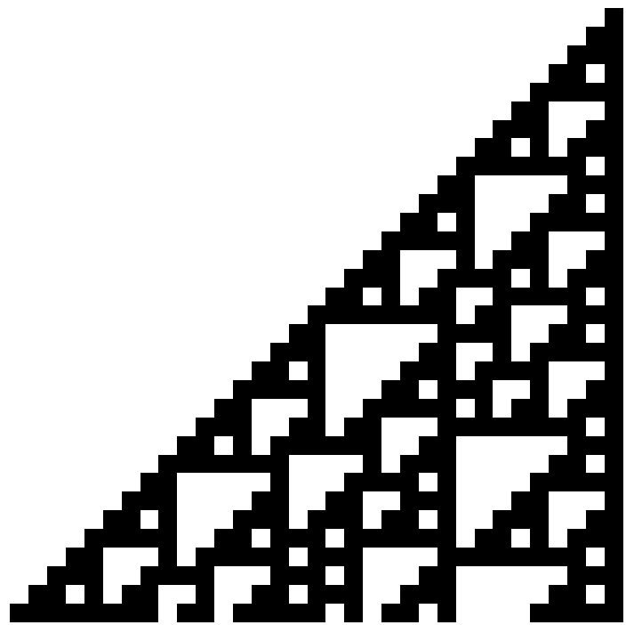
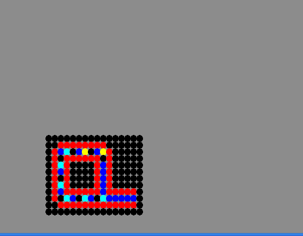

# Episode 5

> /主视角自动日志：0001.01.01 08:47:05.037302/

......？

“呲...”_ν=1.4204GHz，持续1.523μs。_

视野中的一切陡然放缓，时间近乎冻结于静谧的繁星之间。

飘离的主镜定格在空间中，异形镜面的旋转也迅速滞缓；狂暴的聚变喷流化成了徐徐水波，高频舞跃的等离子体被慢放为迟钝的蠕动。

> /检测到高频信号。自动将全脑模拟提速10^6倍。注意 废热过高\[1][^1]，可维持时间有限。/

“呲...”_ν=1.4204GHz，持续1.523μs。_

卧槽，土著朝我发信息了？！

它真发啊？这么快？

我的思维还突然变快了，这倒是挺牛逼...也不奇怪，我现在是个全脑模拟啊。只要算力足够、延时不高、废热没爆，就可以随便开变速精灵，以比现实世界中的人脑快得多的速度运行很正常...

但是...不是哥们，几微秒就来一个脉冲，这是打算发多少信息？难道直接甩114Tbit的罗塞塔词典过来？或者更极端点，难不成打算一股脑儿送LLM语料那种规模的玩意，让我自己学？

我一个傻不愣登的裸猿脑子怎么可能人肉解析那种玩意啊？

冷静冷静...总得先试试看。实在不能处理再说。

它们像打节拍似的，隔几微秒就来一次全同的脉冲。不调频也不调幅。

能不能把这理解成布尔值...？

这帮土著也打算用二进制给我编码吗...也正常，简洁易猜。

所以...这是要怎么才算代表1bit？我咋知道什么时候是0什么时候是1？

“快来点书！通信原理无线电原理什么的，啥都可以。”

“呲...”_ν=1.4204GHz，持续3.046μs。_

“它又开始发了！能不能把我思维再加快点啊？一百万倍不太够啊！”

_已经达到类脑计算的开关频率极限。_

废物。

手忙脚乱、一目十行地往脑子里灌了一堆知识后，时间似乎过去了好几分钟...哦，几百微秒。

没动静了。土著的第一条信息似乎这就已经停止了...？

虽然也可能是一大串0...

问题不大，日志里都记着。

得把各种可能的编码方式都逝一下。

嗯...感觉前面几次忽闪忽闪的，像是在对齐时钟，或者表示固定的帧头...可能没有什么特殊含义。

也可能有，但管他那么多，先按这种可能性解读一下。

那么，每个码元长度\[2][^2]就是1.523微秒...正好&#x662F;_&#x3BC;子的平均寿命_。波长也像阿雷西博信息一样选择了H I谱线，不知道有没有什么特殊含义，先当它没有吧。

然后，只需要把有信号的和没信号的时间段在脑子里抄下来...

“1010101 ....... 1010101

1111111 0000000 1111111

0000001 0010100(2.84GHz) 0000001

0000000

0000010 0010100(2.84GHz) 0000010

0000000

0000011 0010100(2.84GHz) 0000011

0000000

0000101 0010100(2.84GHz) 0000101

0000000

0000111 0010100(2.84GHz) 0000111

1111111 0000000 1111111”

呃。。。。。。

这谁懂是在说啥啊？？

这我读个集贸啊？

“百毒一下，有啥和这些信息看起来很像的东西吗？”

没有回应。

这方面它还不如GPT。

不要慌...不管读不读得懂，我都已经打算不回复了，不影响结果...

仔细思考一下...

如果认为开头的10101是用来对齐时间的话，那没啥含义，可以直接扔掉不管。

然后...剩下的部分，前面的一坨和后面是一样的，都是两串连在一起的1和一串0。

这是啥玩意啊？数字？词汇约定？

等等...好像可以把7个bit分成一小节。规规整整的，总比特数也是7的倍数。

这是在切分字节吗？还是切分行和列？难不成它们在画二维图像？

那，头尾的两串玩意是不是在对齐，告诉我一个字节或者一行有多长？

连猜带蒙的太不爽了...先看看如果是这样那表达的内容是什么吧。大不了错了再试试别的解读方式。

不知道为什么是7。可能它是质数，便于判断有没有丢包...？又或者只是单纯因为它不大也不小，够用又不太多。

中间还有三个字节是用频率高了一倍的无线电发送的...不知道为什么要突然换频率。

...吗的，真的看不懂啊！不要欺负我这个丈育啊！

“呲呲...”_ν=1.4204GHz，持续10.661μs。_

还来？

“1111111 0000000 1111111

0000001 0110110(2.84GHz) 0000001 0010100(2.84GHz) 0000010

0000000

0000001 0110110(2.84GHz) 0000010 0010100(2.84GHz) 0000011

0000000

0000010 0110110(2.84GHz) 0000011 0010100(2.84GHz) 0000101

0000000

0000011 0110110(2.84GHz) 0000101 0010100(2.84GHz) 0001000

1111111 0000000 1111111”

草，我好像看出规律了...

出现了好几次之前的高频信息...但是又有一半不太一样...

懂了，懂了！

我逐渐理解一切！

它们在定义符号。

频率变高一倍的是用来表示符号吗？为了防止和数字混淆吗...

第一段信息里，有五条小的信息...左右都长得一样...那中间的符号似乎可能是“等于”或者“等价于”。

而第二段信息...

这不就是加法吗？

所以就是——

“1=1，2=2，3=3，5=5，7=7”

“1+1=2，1+2=3，2+3=5，3+5=8”

它们约定了等号和加号。

好！我真机智（振声）！

不知道使用的数字有没有什么别的含义。可能只是示例吧，多加点例子免得误解啥的。

看来是打算用符号主义的办法，从定义符号开始搭建语义的样子。做事还算严格，估计这确实是土著的官方在发信。不过，要严谨的话，还以为会从∅，{∅}，{∅,{∅\}}开始呢...虽然它们选择的不一定是冯诺依曼序数或策梅洛序数。

“呲呲...”_ν=1.4204GHz，持续10.661μs。_

第三段信息...同样的帧头和帧尾，同样把一个Byte切分成7个bit。

好像定义了与、或、非，然后是集合和包含于，如果我没理解错的话。

嗯...挺合理的，最基本的逻辑关系嘛，外星人也在用是很正常的。

定义不太严谨，只是给几个示例让我猜。属于是想形式化但没完全形式化。这也正常，它们可能觉得我这个外星智能大概率也是用神经网络，而类比和寻找共相是基本能力，直接给几个例子更方便，不死抠定义也无所谓嘛。

第四段信息...帧头声明的byte长度变长了。

“1011011111100001 含于 未出现的符号1

0010010000111111 含于 未出现的符号2

1001001111000100 含于 未出现的符号3”

就三串数字？

这...这啥啊？有什么特殊含义吗？

先看一眼十进制形式再说...&#x662F;_&#x34;7073_，_9279_，_37828_......

什么意思...难道要像人类发的阿雷西博信息那样，用它乘以什么东西，表示什么物理上的含义？

先乘一下它们发送信号的波长...不对啊，这也没什么特殊含义啊...哪有几公里尺寸的标志性物体？我的长度也不是这个数啊。难道是像阿雷西博信息表示人类身高那样，表示它们的体型？朝我发信号的大锅的尺寸？不对，现在发这个有什么意义吗，而且体型这么大我为什么之前没看到？

再想想...这是什么数字。

数字。常数。双方都知道的数字...

数学常数，物理常数......

π...e...精细结构常数...

草，我明白了！

它们还没有定义小数点，所以直接用小数点右边的部分来代替了...

所以就是：_0.71828_，_0.14159_，_0.57721_。

自然对数的底e，圆周率π，欧拉-马歇罗尼常数γ。

我又觉得我行啦！

第五段信息...是开根运算，很容易理解。

但是这是否有点太细了？

我可是在肉身解码啊！它们接下来要是打算把一整套和外星文明交流用的逻辑语言发过来砸我脸上，这不要我命嘛？

让一个本科生来干这事属实有点太抽象了。

罢了，先姑且看看它们还打算发什么吧。实在到了人力不能解读的地步再说。

第六段...

“π 含于 未定义的符号4

e 含于 未定义的符号4

γ 含于 未定义的符号4

sqrt(2) 含于 未定义的符号4

未定义的符号4 含于 π 未定义的符号5”

呃...符号4可能是指无理数。那符号5又是个啥？

看上下文，感觉意思像是“的xxx性质”“的xxx属性”...或者直接表示成“是”，但是不同于“等价”，和“含于”也有微妙的差别。

所以大概可以翻译成“π是无理数”“π的属性包括它是无理数”。

这是打算把性质也量化吗...

一阶逻辑都没搭好，这就开始二阶逻辑了？这帮土著一点也不严谨啊，有够随便的。

“111 000 110 010 101 010 100 000 011 010 010 010 001 010 000 000”

这次的byte切分得很短啊...只有三个数。

咝，我绷不住了。这是给人看的吗？？

数字，看不懂啊！

“呲...”

又来？我前一条都没看懂啊哥们！

<figure><figcaption>
Wolfram的rule 110演化的前32步。从上到下每一行代表一个时间步长。
</figcaption></figure>

“
\
1
\
11
\
111
\
1101
\
11111
\
110001
\
1110011
\
11010111
\
......
\
”

...这回的信息有点长。

也好像有点眼熟...

这不就是个一维元胞自动机的演化过程示例吗？

前面那条信息...一模一样...是规则110\[3][^3]的双色一维元胞自动机。

我还得翻一下书和百科。

...但是土著到底想表达啥？

图灵完备？图灵机？通用复制单元？

“呲...”

下一条信息紧接着又来了...

呃，开头先表明这和之前一样是个元胞自动机的规则...然后是一大串很复杂的多色二维元胞自动机规则表，足足有九十多条。

不是，我要肉身按照这玩意来进行计算？

“...百毒一下，就没有c艹或者py的运行环境吗？我能不能写个东西帮忙算啊？”

_不存在。_

不是吧哥，我想写个程序偷懒还得从机器语言和手搓编译器开始？

那我还玩毛啊。

“呲...”

又是下一条信息。

只能先硬着头皮上了......内容倒是很短，是上一条信息的规则下的一个结构。

三圈...方形的环？

这是打算让我自己运行它，看看它的性质？

吗的，我怎么知道它会演化成什么样？让我按90条规则计算不知道多少步，当我是冯诺依曼吗？

等等...

_运行结果序列——_

我好像还真能看出它会怎么演化。

好像是百毒一下在自动计算，让结果直接浮现在脑子里了。

我咋忘了这事呢？我现在脑子里确实有个内置计算器啊！

很好，这样就问题不大了。它的演化过程是...

自我复制的方形环。

<figure><figcaption>
标准Langton’s Loop。土著发送的略有不同，属于变体
</figcaption></figure>

猛扒了一番资料...然后我知道了，这叫做兰顿环。

自我复制结构，加入其它规则还可以变异...

它们想表达的意思似乎很明显。

“生命...”

这可能是最合适的近义词了。

唉，这样通过胡乱猜测特征来弄明白词义，实在不太严谨...不过，恐怖直立猿小时候学习自然语言，反正也是观察别人咋说话然后拟合得来的，只是直觉归纳出共相，知道“哦这个时候应该使用那个词”而没有什么明确定义。所以辩论才要把争定义作为重点...土著这样表达已经挺够用的了。

搞这么复杂的规则才定义生命，而不使用之前的规则110，好像也可以理解...大家都图灵完备，规则越简单，实现某个功能就需要越复杂的结构。二维的康威生命游戏要实现0E0P都已经大到爆表了，要把规则110里的自我复制机器发给我，不知得发到猴年马月才能发完。

...下一条信息是符号定义。把兰顿环从一个复制到两个的过程称作“未定义的符号6”...开始复制的那一部分称作“未定义的符号7”。

符号6的意思，我想应该就是“自我复制”或者“增殖”。

符号7...猜不到啊...和整体相对的部分？基因？还是别的什么？

姑且理解为一种变化和移动吧。

“...”_91.2nm激光，持续10.661μs。_“0000101”

“...”_110nm激光，持续10.661μs。_“0000010”

“...”_85.3nm激光，持续10.661μs。_“0000001”

“...”_91.1nm激光，持续10.661μs。_“0000010”

眼睛突然被晃了一下。

呃。它们这又是在干什么了？

怎么不发电波，突然改成发激光了...？

波长似乎是H、C、N、O的第一电离能。H5C2N1O2......

醋羟胺酸？氨基甲酸甲酯？硝基乙烷？

还是...甘氨酸？

最简单的氨基酸...

“碳基生命。”

可能是这个意思。也可能是亚硝酸乙酯，谁知道呢。

下一条信息...时间平移对称性，定义的显然是能量。

再下一条...

“兰顿环 变化

兰顿环 自我复制

自我复制 等价于 变化 的 未定义符号8

碳基生物 进食/吞并

碳基生物 需能量

需能量 等价于 进食/吞并 的 未定义符号8”

好像明白了...

这是在定义“原因/理由/意图”吗...

和我想得不太一样啊，这么快就开始定义这种和智能体的行为有关的进阶词汇了。

一般难道不是该从宝宝牙牙学语开始吗？

嗯...或者有可能，它们只是想要尽快传达某些信息。所以只挑重点词汇先定义？

确实，已经够简洁了。实际上只花了几毫秒的时间。而且，内容也直白到我这个普通人类都能解读出来...好吧兰顿环那几步除外。

还好它们不想把信息整得复杂，也没有用复杂的加密来试探我。可能是觉得没必要试探我的信息处理能力吧。要不然就是看天书了。

那么，我似乎也不是没有优势...

土著还没有自动化，估计也没有机械飞升鱼人。

而碳基生命总是要节能的，否则在演化史上大概率死路一条。它们和地球人一样是水溶剂的碳基生物，身体尺寸似乎也没有相差多个数量级...也就是说，它们的思维速度很可能不比普通人类快多少。

它们向我发信息的用时也说明了这点。如果它们真的足够快，那就应该在光线一来一回的时间之后，几乎秒回我。

而实际上却花了一个多小时。

当然，这已经挺高效的了。要是古时候的地球，发生外星船降临这种事，各国不知道得扯皮到什么时候呢。

总之，我能思维加速，这就是我的优势。

我完全可以“变速精灵启动！”然后固有时御制114514倍速，进行仔细思考嘛。

只有一个人，比较笨，也不要紧。可以在时间放慢的状态下思考几个月甚至几年嘛，愚者千虑必有一得...就算我决定放弃“不要回答”的方针，决定回复它们，也可以做到秒回，从而降低它们发现“这外星船上居然是个弱智猴子”的可能性...

很好，我有优势！

> /全脑模拟集群即将过热，至多约1600微秒后强制降低思维提速。/
> \
> 啊这。

这下没优势了。

不慌，不慌。本来就不打算回答...来不及读就不读呗...

“...”_1266nm激光，持续10.661μs。_“等价于 未定义符号9”

“...”_2079nm激光，持续10.661μs。_“等价于 未定义符号10”

1266nm，这是土著的太阳，那颗红矮星的峰值波长。

2079nm...这是&#x6211;_&#x5F53;前的散热板峰值波长_。

这是在指代“我方”和“你方”啊...

我咽了口不存在的唾沫。

它们终于打算发正事了吗？

_2079nm激光_...

（“你方/你们...”）

“来到...”

_407nm激光，蓝主序星峰值波长_...

（“这里...”）

主镜在黯淡的星河下缺乏波澜地旋转。

反射着407纳米的绛蓝，于冷银色的星空下流转着晶莹的光华。也许一如九万年之前，它作为光帆反射着560纳米的幽绿色的加速激光时一样。

“的...”

我等待着。

翻涌的不安感在脑海中挥之不去...遏制不住胡思乱想....

它们打算试探？打算询问？

问我为什么在这里吗？问我要干什么吗？

既然要问我，那看来它们之前确实不知道我的存在...不然也不会用这么泛用而谨小慎微的沟通方式...

如果是换位思考成地球人类，天上突然亮起个外星飞船，人们大概会被它的引擎吓得屁滚尿流...我不知道这帮土著有没有被我吓到，我只知道我有点被它们吓得屁滚尿流...

还好现在有证据可以再一次说明，这确实是土著文明...

所以...这是不是真的意味着，歪星仁不少？那费米悖论又是哪里出的问题？

我被搞到这里不会真的也是高等歪星文明干的吧？

“符号声明...”

......最后一个词汇送到了。

简短的一百余个bit，汇聚成一句谨慎的质询：

“你的意图？/你们来到这里的意图是？”

<figure><figcaption></figcaption></figure>

***

[^1]: \[1]兰道尔原理给出了不可逆计算的能耗下限。单次擦除操作有能耗下限，所以单位时间操作数越多，废热就不可避免地越高，至少线性增加（现代CMOS器件的增长率更快，但这里是类脑计算，假设它增长接近线性）。同时，越低温越节能，所以要泡在液态甲烷里，但这也要和散热板面积与热泵的消耗综合考虑，取得一个平衡。至于这里为什么使用不可逆计算而不是基于nSQUID等的可逆计算，主要是为了减重。

[^2]: \[2]数字通信中，一个二进制位所占用的时间间隔的长度。

[^3]: \[3]下一步状态取决于自身和相邻元胞的一维元胞自动机一共有256种规则。其中，规则110及其镜像不完全随机也不完全混乱，并被证明是图灵完备的，也是已知最简单的图灵完备系统。
