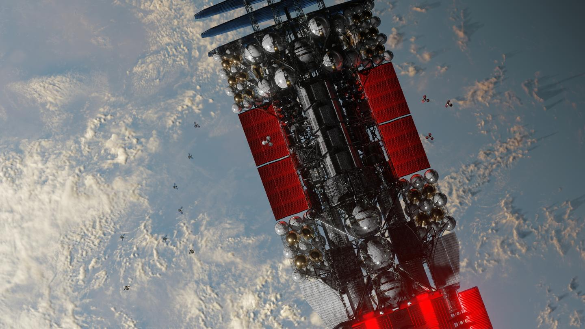
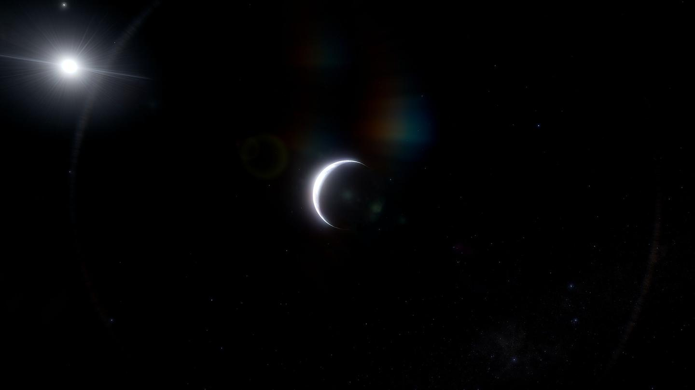
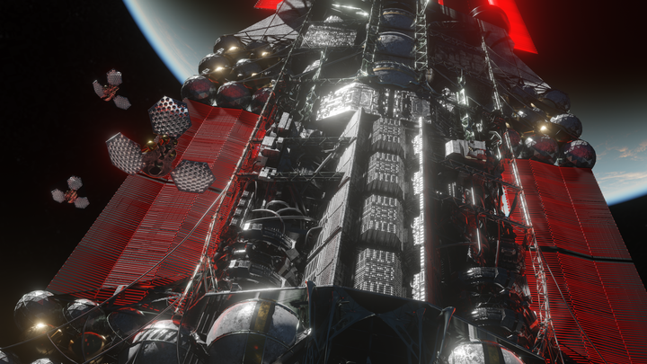

# Episode 7

<figure><figcaption></figcaption></figure>

> /主视角自动日志：0001.02.12 23:44:57/

唉又是无聊的一天。

今天结束前照例再看一眼土著。

诡谲未知的橙棕色行星。一如往常，悬挂在约三十个天文单位外。

密集的星点贴着它们的大气缓缓游移，大约是比较大的空间站集群。

它现在差不多转到了乙的对面，可以看到大半个行星表面沐浴在红矮星的日光里。云絮缭绕的永久气旋在日下点附近游走着，暴露出那座巨大的黑色尖塔。

讲真，完全猜不到它的作用是什么。

那玩意比大气层还高！

虽然好像科技含量比不上我现在的躯体，但也是个离谱他妈给离谱开门的超级工程...

但它半点动静都没，仿佛压根不带任何功能。奇怪得很。

算了。万一这帮土著就是喜欢搞行为艺术呢。人类也喜欢造奇观嘛。可以凝聚力+3，如果土著有凝聚力的话。

土著的无线电干扰仍然在继续，乙卫二的外泄电波也全是噪音。和往常没区别。

这帮鱼人真有耐心...都过了两个多月了。

我还是不敢回复，一直装作无视它们。

它们除了一开始重复询问了一次，也没有再朝我发过东西。

双方就这样保持着诡异的寂静。

没办法，我的最优策略就是先发育......得发育一波，才有底气去接触它们。只要我余力充足，之后不管是敌对还是不敌对，主动权都在我这边了。

_首枚探测器约15分钟后飞掠甲卫三近点。_

脑中冷不丁浮现一句提醒。

有一分多钟延迟的探测器的远程视野里，惨白的月牙在深空中肉眼...哦不，机眼可察地逐渐变大。

泛着清淡的冷光，像写在黑渊中简洁抽象的符号。

<figure><figcaption></figcaption></figure>

好吧，该考虑眼下的事了。先不想土著了。

...我身上的引擎属于是拉胯但不完全拉胯。虽然推重比感人，但它能在路上一直疯狂加速，飞到半路又立马把屁股转过来减速。

飞过&#x8FD9;_&#x31;.93AU_ 的路程只花了七十二天...离目的地只剩两千多万公里，再过个十天就差不多到了。

不知道该说自动生产程序是高效还是猴急。飞到最高速的时候，它甩了一大堆飞掠探测器，让它们不减速而是持续高速滑行，像拆掉了刹车的泥头车一样直冲甲卫三而去，可以比我本体提前十天抵达。

所以，我现在正在看探测器传来的视野。

虽然我的主镜的观测能力很猛，但是甲卫三几乎是完全用它那一片漆黑的背面对着我，只能靠红外成像。所以那个包浆画质......分辨率低得像是用门锁拍出来的。

百毒一下说必须得仔细看一看向阳面，利用短波的恒星日光，获得米级的分辨率，才方便进行规划。

甲卫三年龄不大，自转倒是已经老态龙钟，一天相当于三个地球日。大概是早期被狠狠地创了导致的。估计那次撞击比较接近公转面，所以转轴并不大，没有像天王星一样被干倒躺平。

逼真的细节接踵而至。探测器的眼睛浸泡在浓稠的暗夜里，像是于幽深的水底向着月牙状的井口急速上浮。

接着，飘忽的月牙展开了，天地倒转，那抹亮色一下子由错觉的天穹化为坚实的大地，不再无凭无依。

仿佛引力终于又发挥了作用，霎那间产生了下坠的错觉。

一号探测器在日光中浩瀚的沙漠上空低低地飞掠而过。稀薄细碎的对流云铺撒于其上，弧状、复荚状、墙伏状，形貌俱全，逸散着，像悠远的梦幻。

后面的探测器紧随其后。沿着不同的角度，以保证视野覆盖整个甲卫三的表面。

北半球是一大片黑色的玄武岩沙漠，暗得跟缺了贴图似的。看起来曾是洋中脊的火山带分布在单调的沙漠中，极地附近点缀着稀拉的零星水体。

这片儿大约全都是洋壳...火成岩，看颜色就知道含一大堆镁和铁。遥感表示有不少暴露出洋底的多金属结核和热液硫化物矿床。

南半球似乎更多是花岗岩质，大部分被沙漠覆盖。细碎的古陆核突兀地矗立着，裸露的大陆坡尚未被严重风化，裂谷像是被不可名状的巨斧切削而成。一条狭长的水体横亘沙漠，疑似是曾经最深的海沟。

最大那个湖比地中海还大，好像不太适合称之为湖了。蜿蜒的河流像行星的伤口，将群峦的裂纹勾勒得更加醒目。还不错，地表径流对工业来说是个好东西。

背面有巨大的红外热源，大概是火山啥的吧。嗯...正常，这行星比地球这种老登年轻多了。地球在太古宙也挺活跃的，大洋地壳和岛弧连续产生了十五亿年来着，没记错的话。

看来前些天胡乱速通的入门地质学还是有点用的嘛。

可惜前半段路没怎么学，最近几天才学得进去，导致现在只能1/10瓶水晃荡。

——路上八十几天，毛都干不了，自然是要找点事来打发时间的。

最合乎接下来利益的做法，自然是好好学习天天向上，多了解一下可能用到的芝士。

即使我想醉生梦死，沟槽的百毒一下也根本不给我机会...所有游戏之类的全是看得见摸不着，文件都完好但没法运行，就像账上有十亿甚至九亿但支付被锁花不出去一样让人咬牙切齿。即使要娱乐，也只能看只读的作品。

还不如捏着鼻子看看可能有用的教科书。

但是...可恶的演化让脑子持续在不感兴趣的事上集中就有负反馈，这个b全脑模拟还把这种废物功能给完全模拟了出来。看书看久了就有一种无关于疲劳的厌恶感，一直学不进去。

明明我都不用睡觉了，说明脑子已经被魔改了，睡眠的清除腺苷和剪枝之类的功能被别的方式满足了......那上传我的时候，为啥不顺手把别的劣根性也除掉呢？

铲屎山铲一半，不上不下的。

但是这不该成为一个问题。

都不做人了，如果不对自己动点手脚，怎么说得过去呢？

我要超越人类！

在花了前一个多月，半懂不懂地查阅了一堆神经科学资料之后，我发现干预注意力的方法似乎意外地简单。

已经基本确定，运行我的硬件是基于RSFQ超导器件的类脑计算。没有做成基于nSQUID的可逆计算，所以还是受到兰道尔原理的限制。速度超级加倍就会把脑子烧了也是因为这一点。

我还可以访问自己脑子的所有突触权重。但是没啥用...反正也看不懂。主要操作还是靠百毒一下来执行。总之，它似乎严格映射了生物脑子。

所以，抑制中脑-皮质多巴胺环路中在皮质的虚拟D2受体敏感性，就可以改善动机水平\[1[^1]]。

嗯...这算不算给自己做心智手术...？

结果还算成功。没产生什么奇怪的情况，开始学得下去了。

其实要给大脑狂灌芝士的话，还可以结合思维加速buff...但缓慢度日实在有点折磨。要不是担心突发状况比如土著整幺蛾子，我巴不得多给思维减点速，或者想个办法长眠一觉。反正现在又没有迫切的短时间内大量学习的需求，就不必折磨自己了。所以这两个月是正常体感时间度过的。

我已经习惯了这抽象境况了。这两个月想了很多，学了很多......虽然仍然一片茫然。飘在深空里根本没什么信息源，空想也没意义。

探测器掠过了近点。像抵达时那样迅捷，它们转瞬即逝地重新没入了虚空。已经从月牙变成凸月的甲卫三在视野中远去，重新融入静谧的繁星。

_信息已经足够。需要立即决定任务中心。_ 第三个探测器刚开始飞离甲卫三，百毒一下就发话了。

明明后面还有好几批探测器啊...它这就算勘探完了？

......所以任务中心又是个什么玩意？

是让我来决定具体在行星表面的哪个地方进行开发吗？

绷，它到底干不干事啊？说好的自动呢？难道不应该全自动进行完美优化吗，怎么还得我来决定去哪生产......我对地表成矿情况和工业的规划都一窍不通啊！

“能不能来点这方面的指导？”

一张地质图怼在了我的视网膜上。除此之外，毫无反应。

这沟槽的东西一定是在故意折磨我。

罢了，既然它冷眼旁观，那也没办法，只能自己硬着头皮上了。实在不行也可以胡乱指定一个地方。

我想想...

关键是找不同，然后就可以照抄地球经验了。

路上我已经总结过了。甲卫三没比地球小多少，恒星金属度也没比太阳高多少。和地球的演化应该是类似的。

区别大概只有：

——鸟不拉屎，没有生命，所以没有生物成矿、没有化石燃料，也没有氧化性大气。可用的只有岩浆矿床和热液矿床；

——乳臭未干，才15亿岁，地壳薄，陆壳少，像太古宙的地球。古陆核大概像很久没整理的桌面一样七零八落\[2[^2]] \[3[^3]] \[4[^4]]；

——比地球热，水少，估摸着是被光解逃逸了大半\[5[^5]] \[6[^6]] \[7[^7]]，这方面倒是像十亿年后的地球似的\[8[^8]]。属于是年纪轻轻就秃了。只有两极有一些湖泊和地表径流，湖里的无机盐也许比地球浓不少。因为缺水，可能板块运动也停了大半，生长边界不知道还剩多少。但火山地震还是挺活跃\[9[^9]]。

我的需求很明确，就是非常需要水和矿。

行星也就这点优势了。水能极大节约散热结构，廉价地防止机器被废热烤得红温，海水对氯碱工业也是不可或缺；矿的开采成本很低，比混合得跟抽水马桶冲过的稀一样均匀的小行星要令人满意多了。

还有个因素是恒星。供电主要是使用致死量的朴实无华的太阳能板子，所以得保证阳光充足。

没有生物成矿，我主要应该考虑。但是，现在的数据纯靠表面光谱，一点钻探都没有。鬼知道这图上仅靠遥感数据推算出的成矿情况有多不准。所以可以抛开矿物问题不谈。

那么就只需要考虑日光和水了...

南半球现在是夏季，水集中在高纬度。

不妨在南极附近随便找个有水有湖、看着像地球化学块体或有一堆火成岩的地方。

完事。

应该不用太精确吧...？自动生产程序肯定会自己规划的。我的选择大概顶多影响一下一开始的着陆。嗯就这样吧。

> /已设置任务中心-2。/

信息在脑子里冒出来。然后，视野突然天旋地转。

紧随前三个探测器的屁股、尚未抵达甲卫三的后续飞掠探测器们，猛然从热RCS喷口里猛烈地喷吐起了等离子体，在深空中滑移着变轨。

月牙在摄像头视野中逐渐偏移到了中央。

......？这是要干嘛？

怎么让探测器直冲甲卫三怼过去了？

不是哥们...要撞了要撞了啊喂！！

瑰丽的白昼驱散了黄昏。

炽热的地表化为万亿吨璀璨的火流星，漫天岩雨燃烧着划破了暮色。龟裂的地面此刻如绸缎般柔软，水波似的起伏向四周扩散着。

冲击角度很斜，大部分碎片被横铲着向同一侧飞溅出去。纷飞的碎块依次穿过对流层、平流层、中间层、暖层和散逸层，又拖着灼热的尾迹落回去，给行星圈上岩屑的星环。

撞击尘久久未散，但依稀能看到巨大的云团下流动着炽红的岩浆。

这景象是第五个探测器传来的。第四个探测器最后的画面只有扑面而来的砾滩海岸和稀薄的气动加热等离子体。

“......”

刚有点回过神，脑子还在宕机...

然后第五个探测器就也创了上去。

后续的探测器携带着它们的水罐，紧随其后，葫芦娃救爷爷地接二连三地怼在了大地上。

一排夺目的眩光闪过，甲卫三的晨昏线上顿时被种出了一排比平流层还高的蘑菇。

总&#x8BA1;_&#x36;400万吨TNT当量_ 的能量被释放到了那片无辜的海滩上。碎岩四散溅落，火雨遮天蔽日。

留下一连串的坑，像打点计时器在纸带上怼出的孔。

“...卧槽百毒一下你这是在干什么？”

我惊魂未定。

_制造用于抽水储能及氯碱工业的蓄池。_

......呃。

6。

“所以只是为了挖坑？”

没反应。

可能是觉得我无意义的反问太弱智了...

之前已经发现，它不回答有两种情况。一种是不想说，一种是我已经猜对了，懒得回答。

所以这是在顺便用冗余的探测器砸几个之后工业要用的大坑，免得之后再费力气挖？

怪不得送探测器的时候带了几万吨水罐。原来是当KKV用了。

从高速飞船乱丢垃圾确实是个破坏力巨大的方便操作...本质上这些动能只是源于被浪费掉的燃料能量。

回收一下这些能量，还顺便节约了核弹。

...属实跟老太太一样精打细算，什么都想着废物利用一下。吝啬极了。

烟尘散去，星空又恢复了平静。

体内传来了聒噪的声音。

怎么感觉散热板开始红温了...

是不是自动生产程序勘探到了足够的信息，为了像资b家一样榨取最大收益，对开发甲卫三做准备，开始针对性地重冶制造新设备了？

有只眼睛的余光看见我肚子里飘出来一连串的半透明容器......运载器小心地托举着它们，避开载荷散热片，像是担心鸡蛋被烤坏了似的。

“这是在做啥？”

_生物化学合成室。酶促反应室。_

“不是，哪来的生物？”

_核酸打印。_

还以为我现在是纯纯的机械生命来着。过了这么多天才知道原来也可以用碳基玩意啊......

诶，想想也是...归根结底，机器是某种用于完成目标的结构。编辑出的碳基生物，当然属于机器的子集啊。

术业有专攻，如果百毒一下要生产聚合物，拿碳基玩意做工具当然很正常。为了高效自然是全都要，只走一条路属于自断手脚。

随它做吧。反正不需要我操心。

前仨还活着的探测器继续在深黑中滑行着，我打算让它继续飞掠其它行星。但一时半会也飞不远。先不管它。

已经又是新的一天了。但日期意义不大。反正既不需要睡觉，也没有G2V黄矮星来指导我日出而作、日落而息。

说起来...这些天试了好几次寻找太阳系。

找了半天，完全没找着。

找不到也挺正常。六万光年，说明太阳系几乎在银盘的对面。

即使不提核球区的高密度介质，往外也有好几圈分子云。不被星际消光完全挡住才怪。

<figure><figcaption></figcaption></figure>

星河就那样挂在无穷遥远的天幕上，铺着星际介质掩出的暗色。眼花缭乱的繁星，完全无从分辨哪里是故乡。

不知一切熟悉事物的栖身之所在何处。

隐约地又有些失神......

现在是...公元...二百三十三万五千年？

荒谬。

> /主视角自动日志：0001.02.21 14:55:32/

着陆，启动！

好吧，我只有一部分正在进入大气。剩下的本体还要一天多才到。但甲卫三已经明晃晃地挂在远处，不用缩小FOV也能直接看清了。

百毒一下提前把身上大部分载荷像下饺子一样全都扔了出去，准备让它们利用大气减速，抵达得早而且还能节约燃料。

感觉我现在空得像个骷髅架子。八成的载荷都给拆光了。用来支撑载荷的结构材料也被废物利用，拿去做成大量的外壳、热盾、襟翼和减速伞了。

密密麻麻的热点正在甲卫三的南极大气上层涌动着，像一大群饥饿的蚂蚁，正在一拥而上。

......这货怎么把载荷往同一个地方扔啊？

难道不是应该把挖掘机扔到矿上，光伏扔到沙漠，分散到最适合的位置吗？

等一下......

那里隐约有一片反光的湖面。

“你这是在...烤干那一整个湖？？”

_利用进入大气的气动加热热辐射。蒸发目标湖泊。_

哦豁，我好像明白了。

“为了节省之后晒盐工艺的能耗吗？”

没有回应。

大概是猜对了。

这都能废热利用，我是没想到的。

“能省多少？”

_\~370PJ._

“你真抠门。”

等离子体糊在镜头上，视野里各种颜色群魔乱舞，看不清楚状况。

从远处看去，氤氲的云气被璀璨夺目的辉光照亮，仿佛夜幕上撒了一把金粉。

我只能想象...让人密恐发作的陨星正在燃烧着划过天空，灼热的尾迹交织成火网，源源不断的热量倾泻而下。

苍穹被烤得炽红，海水随之沸腾。

嗯......如果地上有植物，热辐射引燃的森林大火怕是能烧遍一小片大陆了。

不得不说，这操作一箭多雕，暴力又高效。几十亿吨tnt的能量嘛，不用白不用。

差点忘了我这躯体的规模有多哈人了，靠进入大气的动能转热能就可以蒸发地球上一个太湖的水量......

遮天蔽日的着陆器掠过了湖面，如同吞噬大地的巨网，黑压压地罩到了对岸上。

着陆了。

等等。

我...抵达另一个世界的大地了？

有点发怔。

我以为自己已经熟悉了这极度荒谬的处境的。

但是......从载荷镜头往外望了第一眼后，幻梦般虚妄的抽离感依然席卷而来。

与这感觉相反的是亲眼所见的画面。

朝霞已经在天边浮现了。

天高地迥。石岸延展向天边，浩渺的水面平铺而去。

悠悠的卷云之间，着陆器的万千尾迹还未散去，连同曙光中的白主序星一起荡漾在波光粼粼的倒影中。

细节真实得就像......吹拂在脸上一样。

在深空中滑行的时候，我无数次百无聊赖地瞎想，想象着自己踏上异星土地的感觉，想象着将要见到的透着不知所谓的荒诞但逼真得不容置疑的景色......但和现实终究不太一样。

这算什么？为什么我会在这个地方？这是现实？

我是第几个踏足异星的人？曾经想象过的最遥远的可以前往的地方是哪里来着？这样的湖面......和我记忆中一切类似物相距六万光年？

那些波光下的是二百三十万年前不知何处吹的黯淡蓝点上一样的氢氧化合物吗？细碎的砾石也和数以百万亿亿计的其它世界一样被水蚀着在亿万斯年间沉积而成吗？

我已经在太空中预想过许多次自己将会有诸如此类的乱七八糟念头了。果不其然。

...还是收收这卵用没有的多愁善感吧。碳基猴子被演化塑造而成的些许意味不明的情绪罢了，以后有的是时间去感知。

...虽然有一秒多的延时，但我可以远程控制已经着陆的地面设施了。

嚯。很好，终于可以不那么无聊了。虽然这行星上也鸟不拉屎，好歹比黑不溜秋的深空好一点。

载荷被集中扔到了南极，夹在两片水体之间的狭长陆地上。一侧是刚才被气动加热蒸发了大半的可怜湖泊，另一侧则是隐宿三上最大的湖。

......称作海都没什么问题，它的面积比地中海还大。

确实满足了水的需求。

我徐徐伸出一只视野比较开阔的的眼睛，转动着摄像头。

一片广阔的砾滩。

<figure><figcaption></figcaption></figure>

大概是因为把厂子造在砾滩上，抗震比石滩好，又不会像沙子一样难以打地基吧。

曙光很淡，海面很暗。怎么看怎么像是外星场景。啊不对，这就是外星场景。

大气纯净得像是刚从海里捞出来。惰性无毒。如果还是人类肉身，抛开减压不谈，说不定能直接把皮肤暴露在这空气里......氨似乎被光解了个干净。正常，水都没多少了，氨早被恒星扬完了才正常。

无所谓，就算有，我也没有鼻子去闻。

不很远处的天边，地面过渡成了坚实的基性岩，探测器在十天前砸出来的一列大坑整齐地烙在岸边。地平线上耸立着正在逸散的尾迹，那&#x662F;_&#x88AB;高升阻比着陆器扔到了更远处的光伏组件_ 留下的。

“所以干嘛把光伏扔那么远？和厂子摆在一起不行吗？而且还扔山上，地形烂得很。”

_极昼区。日光稳定。高山减弱天气影响与大气削弱。发电稳定。降低储能需求。_

......想了想，这鬼地方确实选得还挺有道理。南半球现在正值夏天，太阳能板子可以源源不断狂吸日光。

甲卫三公转一圈久得很，一年几乎等于五个地球年。等到极夜来临，我们早就有能力拔营起寨，把光伏搬到别的地方去了。

百毒一下打算盘珠子的能力确实从来不容置疑。

行吧，接下来我就观摩观摩百毒一下同志是如何开荒的吧。不知道它能不能整点好活。

啊，这样显得我好没用。

<figure><figcaption></figcaption></figure>

> /主视角自动日志：0001.02.22 09:53:37/

它拉了一整天的电线......

拖电缆的方式简单粗暴得令人发指。让一堆车直接从光伏的位置带着一卷电缆，边开车边铺，直接拖在地上。电缆顺便直接给车辆供电。

没有输电线路塔，直接放在满是风砺石的鸟不拉屎沙漠上。电缆是在太空就预制好的，裹着一层不知道什么材质的绝缘。我怀疑百毒一下之前整的生物反应器就是为了生产这些绝缘包层，从而可以直接把线铺在地上，省得造塔。

“你不觉得这做法太绿皮了吗？”

_最快方案。_

浩浩荡荡的地面载具在视野中奔袭着，已经开始在DC-DC降压器件上接线了。好吧，我承认确实快，一天就搞定了。

“所以线芯是拿什么做的？”

_铝。_

差点喷出来，然后才发现自己没有嘴。

“布什戈门，怎么这么low？不用超导也就算了\[10[^10]]，铜和银都用不起吗？开局用点贵的也没有什么成本问题吧？”

_减重。_

哦确实......差点忘了在太空中轻才是王道。我本体没那么多质量可以挥霍。

_将在近点熄灭引擎。即将泊入甲卫三低轨。_

...我的本体也要抵达了。

很近了。

本体在甲卫三的阴影中滑行，曙光的方向浮现出一道蓝白的光弧。本体上的眼睛也能清晰地直接看到大地了。我在身后洒下淡薄的光点，那是一连串的中继星。

我的大脑终于要和地面上的肢体会合力......虽然还是隔着一层大气。

我远控着一小部分似乎不太用得上的肢体，开着临时征用来的地面运输载具，在海边四处瞎逛。

履带在满是风砺石的荒漠上扬起不多的沙尘，眼睛努力在颠簸的飞驰中自适应着保持视野稳定。

我尽可以漫无目的地载着眼睛乱开。反正工业都是由自动生产控制程序去管。

有海浪\[11[^11]]。比地球上弱一些，但仍然轻柔地刮扫着无尽的砾滩，在不知躺了多少万年的碎石上浅浅地破碎开来。

振动感知通道告诉我，它们传来沙沙的声响，仿佛在向着渺远的天边合唱。

恒星悠悠地照耀着，并不急于移动，亿万年来一直如此；慢吞吞地，仿佛永远不会落下。

天空仿佛格外高远。蓝主序星的日光在云隙下飘舞的尘埃中打下几道浅浅的光柱，瑞利散射将它削成了淡雅的橘黄。无垠的湖面也随之泛动起浅淡的金色，在靛蓝中染开。

轻风像是从世界尽头吹拂而来。有一刻，我突然恍惚地有种瞬息间过去千年的错觉。

......没有什么强行规定的任务，也没有繁杂的人际关系要处理......

我像这荒凉广袤的天地一样，有着无限的时间。

不知从何而来，亦不知要往何处去。

只是存在着。

“......你觉得，地球现在是什么样？”我抬眼望向比记忆中更小\[12[^12]]更蓝的太阳，在心底喃喃地进行每日一问。

没有回应。

> /主视角自动日志：0001.02.26 09:53:37/\
> /总可用功率：3.0&#x39;_&#x31;0^12W/_\
> &#xNAN;_/使用物质：2.7&#x36;_&#x31;0^10kg/

才没几天，基础设施已经搭建得有模有样了。

海边的工厂初具规模。就是有些设施搁那非常低技术地直接就地夯土作为结构材料。部分胡乱堆积的混凝土\[13[^13]]也不怎么规则，像几坨屎山，看着毫不美观。

其它的主要结构材料还得是铁和铝，又多又便宜又高性能\[14[^14]]。但悲催的是这破行星没有炭这样优秀的还原剂，导致百毒一下只能电解熔融氧化铁\[15[^15]] \[16[^16]] \[17[^17]]，吞掉了一大半的电。

副产物的氧气被直接通进了隔壁炉子，用于煅烧黄铁矿和黄铜矿，还有氧化制取硫酸和硝酸。

“所以为毛电极不镀贵金属？本来就找不到天然石墨矿，电极这么损耗不心疼吗？还是说你用裸石墨电极是为了直接往铁里掺碳？”

_贵金属对缓解电极侵蚀仍效果不佳。_

百毒一下就输出了一句，像把我当弱智糊弄懒得解释更多似的。

一旁的厂子正在从石头就地取材，源源不断地拉制玄武岩纤维，打算直接拿去当缆绳之类的结构材料。

百毒一下把烧炼玄武岩的熔窑糊在了电解槽的脸上，好几条产线挤成一团。估计是在利用废热，温度相近做一组，把需要散热的产线和有加热供暖需求的产线集成在一起。

挤成一团估计也是为了便于产物和副产物的运输。像一根厂体蜈蚣。

好吧，不止一根了......厂子很快被搭成了看着意大利面状，不知道是拓扑优化还是单纯的乱。

我控制了一辆运输车。往远处开吧，看看风景。

塬神，启动！

嗡。

履带像年过九十的老头一样转了两下，然后就原地趴在那不动了。

不是，没电了？

拉胯的储能。

这也太废物了......得想个办法让它开久一点。

光伏不太行。储能拉胯导致续航不够，到了晚上没一会就得趴窝了。

诶对，我本体身上不是有一大堆裂变堆吗？

我转移目光，回到本体身上。先控制个运载器去载荷区翻找一下。

这些裂变堆也太大了，整个装到地面车辆上怕是能给它压成铁饼......好在为了减重用的全是高纯裂变物，很容易临界，单个单元并不大。切割一下先。

试试把中子反射鼓转一下，中子源怼进去...意外地没有什么问题，正常发电，可以工作。

着陆器直接依葫芦画瓢，仿照百毒一下之前把载荷丢进大气的着陆器设计。

不知道着陆会出现什么屎料未及的问题...所以，隔热大底厚度加倍，降落伞冗余加三倍。很好，看着就很氨醛。

零件都是现成的，工作量比我想的小很多。而且自动生产控制还会自然而然地帮我处理行动细节。

好了，把它包装在着陆器里扔下去。轨道和落点有百毒一下给我自动计算。

又一颗燃烧的火流星划过天穹。它急剧减速着熄灭，旋即展开轻薄的聚合物伞面，仍然以万钧之力砸在了松软的沙漠上，溅起一大圈沙尘。

加的冗余明显过量了...之前载荷进入大气远高于第一宇宙速度，现在速度又低了这么多，能出问题才奇怪。

散热板得换掉，改成风冷，不然太沉了。

就从隔壁厂子拆一个下来吧。

拆点零件肯定无所谓吧？反正百毒一下会补回去。不管啦。

感觉我有点犯贱。

我反复开机测试，直到不会很快过热为止。它肯定十分低效，没有经过任何设计，纯纯是面多加水水多加面。

接着胡乱焊在车上就好了。我不确定车有多少防辐射设计，所以又去隔壁轧钢厂顺了几片钢板过来。

这堆玩意在车体上丑陋地凸起，像个肿瘤。

然后把线接在电容上...

没反应...吗的，绿皮科技还是不太行。

我只能花了几个小时，硬着头皮啃了点书，照着排查问题。又经过了十次甚至九次失败。

终于能充进去了。

平均功率有点不足。管他那么多，能用就行。

无限续航，完成！

就是有点慢。反应堆功重比太拉胯导致的。

给这辆作品命个名吧。

就叫...坏了，我起名废。

诶，它的负重轮数量和5在同一数量级。

......裂变动力黑色高级59改？

不错就叫这个名吧。

感觉有点闲得蛋疼。像人类给自己的一个肌细胞命名似的。

履带式运输车浩浩荡荡。缺水真是太蛋疼了，都没法广泛使用海运。

其中一辆与我操纵的黑色高级59改擦身而过，认不太出的粉碎粗矿之间隐约混杂着似乎是嵌在云母基质上的萤石晶体。我猜主要是用于合成冰晶石，给电解铝用。

荒漠中已经被压出了许多平整的土路，比周围地面的颜色更深，构成的线条像大地上巨大杂乱的绘画。从高空俯瞰会不会像纳斯卡线条呢...这下我成外星文明了。

绵延的道砟已经开始横亘大地，碎石上零星地出现了钢条。这就开始铺铁路了吗...大概是为了节省以后进行运输的能耗？

与之并列的是成百上千的输电线，直直地平铺到地平线外，像大陆的裂纹。毕竟有好几TW的输电量，拉这么多根很正常。不知道这堆清一色的高压直流输电怎么解决谐波和地电流的问题...算了，相信百毒一下的智慧。

天边的光伏在恒星照耀下熠熠生辉。往那儿开的载具主要是在运输维护光伏的设备，比如吹风或机械扫除的玩意，免得阳光被沙尘遮蔽。毕竟那里没水，不能直接拿个泵接上管子对着洗。

我途经早已死去的盾状火山，风蚀下暴露的熔岩管在岩体上穿出黢黑的空洞；绕过岩脉与地堑，与地球迥异的峭壁耸立在漫漫黑沙之中。

我路过干涸的海床，又驶过荒芜的大漠。蒸发岩的碎屑混杂在石块中被扬起。苍茫的远处，依稀可见几台采选一体的玩意正在刨地上裸露的磁铁矿，顺便粉碎可能有价值的基层岩。传统的挖掘机，没有激光采选，也没有生物浸出。毕竟这破地方水少、环境恶劣，大多数工艺用碳基玩意太低效了\[18[^18]]。

摩擦的噪音不绝于耳......呃，不绝于振动传感器。沙石随即被丢去磁选。和地球不一样，这里鸟不拉屎，所以基本没有基于胶体沉积和大氧化事件产生的沉积铁矿床。风化和机械搬运把四氧化三铁散布成高丰度的风化砂矿，把它们广泛播撒在深黑的玄武岩沙漠中。

能感受到...这台松散地分布在行星上的巨大机器...是我的一部分，由无数分离的更小机器组成......正在生长。

没有不可理解的纳米机器或灰盅，只有简朴无华的几个部分：原料采集，冶炼，加工，组装。

但确实在滋生，荒芜的岩土被转变为有序的结构。

不可计数的机械。冰冷，精确，无情。只是生产和扩张着。

直到遮天蔽日，增殖成一群，或许多群，或无数群吞噬恒星的饕餮。

......但是......人类的文明，好像也没什么不同啊。

无非是把工人的手换成了全自动机械臂，把决策人的脑换成了AGI。只是一群覆盖所有产业的黑灯工厂。

比起自复制机器，我现在更像一个机械文明；工厂作为通用构造器，被用来实现更适合甲卫三的设计，而不是制造一模一样的机器。至少暂时不是。

“环境μ中存在系统I，若I有能力获取J⊆μ-I并使其变成和I同样的系统K，则I为μ中的一台自复制自动机。”

我在脑内翻开自复制自动机的原始文献。那些文字是闪耀在二百三十万年前一些晚期智人那1.6kg的大脑中的辉光。

晶体是一种广义的自复制机器。它在溶液这个环境中可以生长。

s='s=%r;print(s%%s+"114514")'
\
print(s%s+"114514")
\
是一台自复制机器。它在搭建好py环境的计算机中可以翻倍。

“把括号里的内容抄一遍，括上括号再抄一遍，最后加个句号。(把括号里的内容抄一遍，括上括号再抄一遍，最后加个句号。)。”或“念一遍这句话”是自复制机器。它在能理解汉语和传播模因的人类之间可以复制。

它们可以很泛用，也可以很娇贵而要求非常特定的环境。

最理想的自复制机器可以在最混乱的气体里存在并复制自身。

最拉胯的自复制机器是经典的自复制机器思想实验里的拧发条机器人：整个宇宙环境已经充满了只差一个发条就完工的机器，机器只需把发条给别的“未完工机器”拧上去，就能完成自我复制。虽然一旦离开这种宇宙，它就寄了。

晶体离开了合适的分散系就没法结晶，所以晶体是相对而言很弱的自复制机器；

现在的我，能够找到一颗行星就开啃，所以是适应范围比较强悍的自复制机器。

地球碳基生物介于二者之间。它们繁衍了千秋万代，但大多数离了地球、大气、水、合适的温度和日光就不能生存。

......我可以增殖，亦可以进化。就像人类的整个工业史一样：用机器和手去制造更高级的机器。

第一次工业革命的工人和简陋的机器是后来一切工业的种子工厂。人口一度锐减至几千时，那几千个人类就是人类文明的种子工厂，只是它发育起来需要20万年。或者把南方古猿定义为种子工厂，只是它发育起来需要600万年。或者把最初的生命LUCA定义为种子工厂，只是它发育成熟需要38亿年...而且很不稳定，有可能始终没有完成发育就被升温的太阳杀灭了。

所以我是种子工厂？

发育成戴森云的种子？

那么，21世纪的人类作为自复制自动机......就像百毒一下的进化不完全版本。

...我这是怎么了？不做人没多久，就把自己异质化到这样胡乱解构人类了吗......

不瞎想了。逛一圈就回去吧。

我开着黑色高级59改转了大半天...严格来说是大半个地球日，1/3个甲卫三天。

恒星就要落下去了，夕阳为渐趋朦胧的大气远端渲上了一层赤辉。

把眼睛转回海边的工业基地看一眼。

远远就看见空气低温分离厂正在冒着袅袅白雾，像低温测试测到一半爆了的储罐。

霍霍空气大概是刚需，而不仅仅是为了搞点液氮。因为这b行星压根没有像样的碳源...没法当煤老板，就只能靠大气固碳来凑合了\[19[^19]]，除非去刨碳酸盐岩。不过那活儿大概是生物反应器在干，和空分厂没什么关系。

瞥了眼地质图，果不其然，压根没画出任何石墨矿。属实麻烦，从聚合物到电解槽的石墨电极的碳都得自己动手丰衣足食\[20[^20]] \[21[^21]]。

海岸附近正在电解食盐水。其它工厂的热管也没闲着，耐腐蚀的特种合金管路泡在晒盐兼抽水储能的坑里，用废热烤水。流量很大，免得莱顿佛斯特效应导致气泡阻碍换热。

氯碱工业也是刚需。氢气被拿去合成氨，氯气用来制取盐酸。

氢还有别的用处来着，比如做燃料电池，虽然自带氧化剂导致它的续航一坨。

百毒一下好像打算把硅也用氢来还原。

氧化剂和还原剂都需要自制，属实亏麻了，能耗大得离谱。

想你了，牢地......要是和地球一样氧气和炭都用之不竭就舒服了。

等等......

百毒一下为什么还要傻乎乎地晒盐？

怎么不用轨道上本体母船的引擎喷流来进一步蒸发湖水呢？

我的引擎喷流威力不是盖的。就算这船性能拉胯，不说毁天灭地，能让天地为之色变还是称得上的。

喷流在大气中穿透性差大概不成问题，一直喷，平衡状态应该允许动能被传递到地表。扩散角比较大？也无所谓，绕远点，保证不波及地面设备就行。

而且这行星刚好气压低，虽然盐浓度高，海水沸点依然比我的智商还低不少，刚好适合喷。

“所以你之前不还用探测器创出大坑、用着陆器进入大气去暴力蒸发湖来着吗，怎么现在又变保守了？”

没有回应。

啧，不爽。

直接试试拿引擎喷地面得了。

我活动着周身的RCS，缓缓把主引擎对准下方滑移而过的大地。

想象一下，聚变喷流的利剑在电离辐射的附魔下从大气层外直直刺入海面......绝壁帅得很。

我，舅是力量的花生！

好了，启动吧。

......不对。

百毒一下不这样做大概是有什么理由的。

是有什么危害吗...？免不了喷到地面设备还是怎么......

艹，差点忘了范艾伦辐射带！

我宣布我是傻逼。

要真在低轨对着喷了，我的中继星就完了...没加多少屏蔽，会被在辐射带里打转的粒子流橄榄的。

差点又把自己给整了。我悻悻地把姿态转回切向。

会不会是我改善自己动机水平的操作导致现在行动力过强，不经过脑子了...？

之后在低轨机动也得注意多加水降低比冲啊...免得自己的喷流在辐射带里绕个圈回来糊脸。

> /主视角自动日志：0001.02.27 15:41:57/\
> /总可用功率：3.1&#x31;_&#x31;0^12W/_\
> &#xNAN;_/使用物质：2.7&#x38;_&#x31;0^10kg/

一夜无事。

极轨上的本体每两小时就会划过天空。如果尚未没入行星的阴影，它会海面投下清冷的光照。中继星座不住地切割着夜空，像群星间游弋的萤火虫。

没有天然的月亮。明明甲卫三的希尔球还挺大来着。

晚上视野一般。虽然可以给夜视视角着色得跟白天一样，但终究有点失真。就先不去开黑色高级59改瞎逛了。

我有些无聊地从轨道上俯瞰工业情况。子个体已经完全铺展开来，奔袭的载具流忙碌不息。

奇怪。

我眯起眼睛...或者说减小FOV。

视野里标出的铜矿运输线...为什么是去那么穷的地方？

我在脑内展开地质图。

按遥感给出的情况，大概3100km外明明就有个富得流油的矿床啊......

如果我没把读的书还给作者，地球上的主要工业储量来自斑岩型铜矿和砂页岩型铜矿，但后者估计是需要生物化学沉淀机制，没在甲卫三上看到。所以全是前者，主要存在于板块交界处的俯冲带\[22[^22]]。

3100km外那条俯冲带明显得多，光谱给出的铜丰度也高得多。伴生的钼、银和金也比百毒一下现在霍霍的地方要多......但是百毒一下却偏偏不派开采机器去那里。

这是啥操作...它在搞什么鬼？为啥不去挖？

仔细看了看，想不到任何不去采的理由...

地质状况稳定得很，还直接露天，没有任何不利因素，简直是喂到嘴边甚至食道里的肉。

矿的品味也极高，绝对是血赚的。

总不能是底下住着地底人吧？

“喂，你眼瞎吗？那么大一片铜看不到吗？”我问。

没有回应。

不明白它到底在想什么。

我寻思着要不要亲自帮一把...

虽说之前我好像一直属于帮倒忙，学乖了不少......但现在这不过是搬个矿而已，哪能出什么岔子。就算最后发现是因为那里有什么答辩之处导致百毒一下放弃开采，我也没多少损失嘛。

试试水吧。派几台矿机过去。

出乎意料，非常顺利。没有遇到任何问题。

确实就是喂到嘴边的肥肉，才运了没几车，我怀疑实际收益已经超过百毒一下在之前那个破地方的总和了。

这不没问题吗......百毒一下是真的选择性失明了是吧？

......就在矿石运送了一定距离时，百毒一下突然如同被踩了尾巴的猫猛地跳起来似的。它立刻调度了一堆载具，争先恐后地朝我的采矿队伍冲去，开始接收上面的碎矿，像是去迎接自己失散多年的亲儿子。

“...不是，这又是在发什么癫？你刚才不是还不屑去采吗？”我一脸懵。

但它只是接收我已经运回来的矿，完全没有自己派矿机帮忙去挖。

这又是搞什么幺蛾子？

......我发现，一旦运到一定距离，百毒一下就会突然规划一些其他的车辆去接收那些矿物。而在此之前，它像瞎了一样视而不见。前来接收的载具，在大漠中划出了一道整齐的分界线，仿佛那里有一道无形的不可逾越之壁。

分界线有一点弧度，就像是...一个大圆的一部分。

难道是离远了，它就无条件不去了...？

为什么啊？

我得再试试......

啊对，可以设置任务中心来着。我再把一个任务中心直接设在那片铜矿上，不信它不采。

> /已设置任务中心-3。/

信息刚从脑子里冒出来，我放置在那儿的矿机就开始了全自动工作。它们迅速协调，很快规划出了比我手操高效得多的产线。

但是...百毒一下压根没有把任何机器从第一个任务中心调过去。

不是哥们，怎么突然变弱智了？

还得我自己手动控制载具，把它们开到铜矿附近，它们才开始加入第二个任务中心的工作。

什么玩意？

我把目光转向行星的另一侧。那里有片大型火成岩侵入体，在大约4000km开外。露天部分的铬和铂系元素已经肥得流油了，像南非布什维尔德火成杂岩的翻版，让人垂涎欲滴。

但百毒一下对这块宝地就是置之不理。

再看看......很快就发现了第三片被无视的富矿。一大丛锰榴石英岩遗留下的的富锰风化层\[23[^23]]。

还有更多，疑似撞击加热成矿的富矿陨石坑，伴生不少钴镍铜铂的一大片钛铁矿...全都被无视了。

3037km...从任务中心往外，甲卫三球面测地线长的大约3037km处划出的圆形，是个分界线。

有最大范围。每个任务中心都有工作范围。

像社恐不敢出门似的，死活不离开这个范围。

弧长3037km......那就是......一&#x4E2A;_&#x7403;心在任务中心、半径2998km的球体_，在甲卫三表面截出的弧。

也就是0.01光秒。

每个任务中心只顾及自己周围0.01光秒的球形区域吗...？

对工业来说，这规则不仅脱裤子放屁而且还是纯纯的阻碍啊...

而且，不多不少，使用了人类的“光秒”这并不基本而充满人为的单位。

毫无道理的机制，简直就像一种...

刻意的游戏设计...？

这破玩意的行为也太诡异了。

但是，绝对有某些规律。

好吧...看来必须做点实验研究一下了。

我要摸清自动生产控制程序的规则。

***

[^1]: \[1]Floresco S B. Prefrontal dopamine and behavioral flexibility: shifting from an “inverted-U” toward a family of functions\[J]. Frontiers in neuroscience, 2013, 7: 62.
    \
    https://www.frontiersin.org/journals/neuroscience/articles/10.3389/fnins.2013.00062/full

[^2]: \[2]陆壳比洋壳更古老，所以经历分异而分两层（其实硅镁层和硅铝层的分类在学术界已经过时，现实没那么简单，但这里暂且沿用常用说法）。这需要足够的时间，因此甲卫三的古陆核比较细小零碎，大多是刚刚发育没多久。

[^3]: 

[^4]: \[3]大陆地壳主要形成于太古宙，具体来说是约30-25亿年以前。在此之前，冥古宙到太古宙的早期陆壳，主要由花岗质片麻岩区和绿岩带构造单元组成。关于最早古陆核的形成，是洋壳先发生一些俯冲、多层上下挤着形成原始陆壳（俯冲聚集模型），还是别的机制先形成一点陆壳、有助于俯冲于是产生更多陆壳（例如地幔柱模型），目前不得而知。但太古宙已有陆壳，且发现了Vaalbara、Ur、Kenorland等超大陆。这足以用于参考类似3000Ma前的地球的甲卫三的状况。（注意，陆壳不意味着陆地，当时地球的陆壳可能大部分还是位于水下，只是比洋壳厚）

[^5]: \[5]也有研究认为光解的贡献有待商榷，地幔在\~3000Ma甚至更久远之前都在净吸收水，导致海洋可观地失水，30亿年前的海洋体积比今天高1.6\~2.1倍：
    \
    Korenaga J, Planavsky N J, Evans D A D. Global water cycle and the coevolution of the Earth’s interior and surface environment\[J]. Philosophical Transactions of the Royal Society A: Mathematical, Physical and Engineering Sciences, 2017, 375(2094): 20150393.
    \
    https://royalsocietypublishing.org/doi/full/10.1098/rsta.2015.0393

[^6]: \[6]同时，紫外光解导致氢逃逸的贡献仍然不低，逃逸量相当于0.1\~1个地表海洋的质量（甲卫三所受紫外线更强、引力更弱，逃逸将更强烈）：
    \
    Zakharov D O, Bindeman I N. Triple oxygen and hydrogen isotopic study of hydrothermally altered rocks from the 2.43–2.41 Ga Vetreny belt, Russia: An insight into the early Paleoproterozoic seawater\[J]. Geochimica et Cosmochimica Acta, 2019, 248: 185-209.
    \
    https://www.sciencedirect.com/science/article/abs/pii/S0016703719300274

[^7]: \[7]Zahnle K J, Gacesa M, Catling D C. Strange messenger: A new history of hydrogen on Earth, as told by Xenon\[J]. Geochimica et Cosmochimica Acta, 2019, 244: 56-85.
    \
    https://www.sciencedirect.com/science/article/pii/S0016703718305349

[^8]: \[8]具体来说，是先拥有足量的水体、启动了板块，但恒星随即在接近演化晚期时越来越亮，于是才更快地失水，海洋在逐渐干涸中露出部分已经形成的大陆坡，甚至露出部分比较浅的洋壳底部，所以很多地方是洋壳的玄武岩。
    \
    同时，风化的时间不够，所以这些露出水面的地形尚未被完全抹去。（地球如果失去板块运动，也会逐渐风化，在足够长的时间后，硅铝层变成均匀铺在表面，而不聚集）
    \
    作为对比，在太阳系中，只有地球有花岗岩为主的硅铝层。而太阳系其它岩质行星缺乏水而缺乏板块运动，表面基本都是玄武岩、斜长岩这样的基性岩。

[^9]: \[9]太古宙的地球也更热、地温梯度高、火山和岩浆活动广泛，地幔柱构造体制占主导地位。

[^10]: \[10]主引擎的超导线圈大量使用II类超导，力学性质差，质脆，不能弯曲；同时并非常温超导，且强电应用要求尽量低温以提升临界电流密度，故不能用于电缆。

[^11]: \[11]风浪是由风产生的，和潮汐是两回事。水体足够大，则水面某处产生的浪在传播后的涌浪可以持续抵达岸边，足够大就会形成拍岸浪。这里的水体远小于地球的海洋，但依然有浪，可以参考黑海的样子：
    \
    https://www.youtube.com/watch?v=GZtOEjAkP\_c

[^12]: \[12]相近的能流密度下，甲的视直径当然小于太阳。

[^13]: \[13]可能使用微生物混凝土：Dikshit R, Gupta N, Dey A, et al. Microbial induced calcite precipitation can consolidate martian and lunar regolith simulants\[J]. Plos one, 2022, 17(4): e0266415.
    \
    https://pubmed.ncbi.nlm.nih.gov/35421143/

[^14]: \[14]卢达溶.工业系统概论\[M].清华大学出版社,2005.

[^15]: \[15]不用熔盐电解，是因为溶在CaCl2里虽然只要1070K，但产物是铁粉而非铁水，会和盐混杂，除杂麻烦。
    \
    许茜,黎阿巧,孙晨藤,等.电化学方法制铁研究的进展\[J].上海金属, 2021.
    \
    https://www.fx361.cc/page/2021/0122/15866096.shtml

[^16]: \[16]亦可参考基于氯碱工艺的无碳炼铁：
    \
    Noble B B, Konovalova A, Moutarlier L J, et al. Electrochemical chlor-iron process for iron production from iron oxide and salt water\[J]. Joule, 2024, 8(3): 714-727.
    \
    https://www.sciencedirect.com/science/article/abs/pii/S2542435124000011

[^17]: \[17]月面工业的熔融氧化物电解：
    \
    Curreri P A, Ethridge E C, Hudson S B, et al. Process Demonstration For Lunar In Situ Resource Utilization-Molten Oxide Electrolysis (MSFC Independent Research and Development Project No. 5-81)\[R]. 2006.
    \
    https://ntrs.nasa.gov/citations/20070018263

[^18]: \[18]Santomartino R, Zea L, Cockell C S. The smallest space miners: principles of space biomining\[J]. Extremophiles, 2022, 26(1): 7.
    \
    https://link.springer.com/article/10.1007/s00792-021-01253-w

[^19]: \[19]CO2合成无定型碳：
    \
    Liang C, Chen Y, Wu M, et al. Green synthesis of graphite from CO2 without graphitization process of amorphous carbon\[J]. Nature communications, 2021, 12(1): 119.
    \
    https://www.nature.com/articles/s41467-020-20380-0

[^20]: \[20]碳转为高结晶性石墨：
    \
    Fogg J L, Putman K J, Zhang T, et al. Catalysis-free transformation of non-graphitising carbons into highly crystalline graphite\[J]. Communications Materials, 2020, 1(1): 47.
    \
    https://www.nature.com/articles/s43246-020-0045-y

[^21]: \[21]无定型碳转为石墨片：
    \
    Tu J, Wang J, Li S, et al. High-efficiency transformation of amorphous carbon into graphite nanoflakes for stable aluminum-ion battery cathodes\[J]. Nanoscale, 2019, 11(26): 12537-12546.
    \
    https://pubs.rsc.org/en/content/articlelanding/2019/nr/c9nr03112j

[^22]: \[22]翟裕生,姚书振,蔡克勤.矿床学.第3版\[M].地质出版社,2011.

[^23]: \[23]类似于巴西的塞拉多纳维奥锰矿。
